# AI 実習 2024 　最終課題レポート

## 各回のグループ討議の要約と個人ワーク

## [第 13 回～第 15 回]

## 最終課題

- **課題期間**： 2024/7/18(木)
- **課題提出期限**：　 2024/8/7(水) 18:00

- ファイル名は、AI-2024A-Final-Report.md 　（すべて半角英数記号）とすること
- 稀に、ファイル名にマルチバイト日本語を入れて Github に File Upload が失敗するケースがあるため

---

<!-- 要 記述 -->

| クラス | 学籍番号 |    氏 名     |
| :----: | :------: | :----------: |
|   A    | 20122077 | Roger Marvin |

---

## レポートの作成手順 (マークダウン記法)

- マークダウン記法[^1][^2][^3][^4]でレポートを作成する
- テキストエディタ＋機能拡張をインストール：
- VSCode https://code.visualstudio.com/download#
- 機能拡張(Markdown PDF, Markdown Preview Enhanced ) セットアップ
- ファイル名は、`AI実習2024A課題レポート(学籍番号)(学生氏名).md `
- 作成したら PDF ファイル、HTML ファイルを変換生成する

#### マークダウン記法についてわかりやすい説明、Web 情報

[マークダウン記法とは？](https://www.bing.com/videos/riverview/relatedvideo?q=%e3%83%9e%e3%83%bc%e3%82%af%e3%83%80%e3%82%a6%e3%83%b3%e8%a8%98%e6%b3%95&mid=4EE93F5EF42F9CAD0CCC4EE93F5EF42F9CAD0CCC&FORM=VIRE)
[Markdown 記法～基礎編～](https://qiita.com/miriwo/items/28d80f46c857de49f34b)
[マークダウン記法一覧](https://qiita.com/miriwo/items/28d80f46c857de49f34b)
[マークダウンの書き方](https://backlog.com/ja/blog/how-to-write-markdown/)

[^1]: (https://www.bing.com/videos/riverview/relatedvideo?q=%e3%83%9e%e3%83%bc%e3%82%af%e3%83%80%e3%82%a6%e3%83%b3%e8%a8%98%e6%b3%95&mid=4EE93F5EF42F9CAD0CCC4EE93F5EF42F9CAD0CCC&FORM=VIRE)マークダウン記法とは？
[^2]: (https://qiita.com/miriwo/items/28d80f46c857de49f34b) Markdown 記法～基礎編～
[^3]: (https://www.sejuku.net/blog/77398)マークダウン記法一覧
[^4]: (https://backlog.com/ja/blog/how-to-write-markdown/)マークダウンの書き方

### 外部ツール画面の図式引用

- 本様式をひな型とする
- 様式中に、マークダウンのコメントとして
  　　`<!-- 要 記述　回答 -->` と記されている箇所は忘れずに適切な記述を加筆する
- 図やスクリーンショットを引用する場合、フォルダにまとめておく
- 1 つのレポートにつき、1 つのフォルダを用意する
- そのフォルダに、md, pdf,html,および, 引用で使用した jpg,png 等ファイルをまとめて配置する
- $MR^3$で作成した RDF は、スクリーンショット画像として本文に取り込む
- $Protege$で作成したオントロジは、`OWL/XML Syntax` 形式で、`file名.owl`　として保存する
- $Protege$で作成した LOD は、`RDF/XML Syntax` 形式で、`file名.owl`　と保存する
- $Sparql$のソースコードは、マークダウン形式に、引用によって記述する

````
  　Sparqlのクエリコードを　```sql  と ```　で囲み、クエリの実行結果も　``` ``` で囲む
````

### レポート提出方法 Github のプライベートリポジトリにアップロード

- 2 学年 4 学期の**API 実習と同じ方法**
- Github のアカウントを作成し、**Practice-AI-2024** という名称でプライベートリポジトリを作成
- そのプライベートリポジトリに、指導員の Github アカウント= **keythrive**を招待する
- Github のプライベートリポジトリに次の名前で、6 つフォルダを用意する：
  - **report1-3**
  - **report4-6**
  - **report7-9**
  - **report10-12**
  - **report13-15**は、**report-Final**　に混ぜてよい
-
- Github のアカウント名、プライベートリポジトリ作成、6 つのフォルダをつくったか？招待を完了したか？について、FORMS アンケートするので必ず回答すること。
- FORMS アンケートはこちら：
  - https://forms.office.com/r/6iMLLYjw1t
- FORMS アンケートに未回答の場合、レポートを取得する方法が確立しないので、必ず回答のうえレポート提出可能な状態にすること

- それぞれの提出期限までに、必要なファイル一式を当該フォルダにアップロードしておく
- 〆切時刻を過ぎた時点で自動的に, 全員の Github プライベートリポジトリから、`git clone`などでファイルを一括ダウンロードする
- 提出が遅れるとダウンロードできず、未提出と判断される
- 真に止むを得ない事由で、提出期限が遅れる場合、事前にメールにて連絡・相談すること:
- mailto: **horikawa.keitaro@kaishi-pu.ac.jp**
- 事前連絡なしに、期限を過ぎた場合、その課題レポートは未提出として採点しない
- Github のアカウント登録、プライベートリポジトリ、ファイルアップロードが不明な場合は、必ず事前に確認・相談するか、すでに出来ている友達から教えてもらうこと

---

## 課題レポートのまとめ方

- 直近のグループ実習 3 回分をまとめて 1 つのレポートを作成する
- 毎回休まずに出席して、グループ討論に積極的に参画する
- グループを代表して発表し、質疑応答、議論、メモを確実にとる作業が大切
- 自グループと他グループの発表をしっかり聴いて、議論模様を簡潔にまとめて報告する
- それぞれの回の全てのグループ発表、および、
- 学生と教員からの質疑コメントを要約する
- ここまではグループメンバ間の協力作業で、差異化要素はほとんどないことが予想される
- 自作の成果（RDF,オントロジ等）には極力 "FOAF,SKOS,DC"など共通語彙を適用する
- **個人の努力を差異化要素**として、さらに踏み込んだ検討・実習の成果を 3 回分の**個人演習**について報告してよい
- 3 回で取り組んだ内容、理解を深めたことを独自レポートとして加筆可能
- 例えば、**作成した RDF,オントロジ,使用した LOD, 作成した Sparql クエリ,その他の AI 手法やプログラムとの連携技、それらの分析・考察・所感**　など

### 本実習・課題レポートに取り組む意義

- 半年後、本実習を「適当にやり過ごした学生群」と、「真剣に打ち込んで突き詰めた学生群」に明確に分かれることが予想される
- 前者と後者とで、成長の差は著しく広がり、臨地実務実習 II の実習成果および企業担当者から評価が如実に変わる
- 1 年後の今頃、就職活動の内々定数（場合によっては、転職ファストパスの数）が大きく変わることが見込まれる

---

## 最終課題

- 第 14 回ー第 15 回「情報家電」オントロジを参考に、最終自作オントロジの作成と活用評価を報告する
- 必要な要件は下記のとおり：

- (1) 設計者（貴方）の立場：　新製品や新商品を購入検討中の顧客に対し、適切なアドバイスを提供するコンシェルジェ
- (2) 作成評価するオントロジとそのアプリの要件：　顧客からのどのような問合せ（クエリ）が考えられるか？　ユースケースを具体的に描いて、それに適切に答えられるための必要な知識・概念・語彙をオントロジとして設計する
- 例えば、白物家電（冷蔵庫、エアコン、洗濯機、掃除機、液晶 TV）、スマートフォン、PC、タブレット、電気自動車、の買い替えを想定して、さまざまなニーズに応えるための知識を設計する
- 多数の製品・商品群がある中、数多の選択肢から、顧客が十分に満足する製品をどういう条件で絞り込むか？
- (3) 購入要件を満たす製品の絞り込みを可能とする　$Sparqlクエリ$の仕様設計
- クエリに整合した、概念・用語・語彙と、その関係整理を製品・製品バリエーション・要求仕様として表現する
- (4) 実際の具体的製品名(LOD)、代表的な属性・共通語彙を使ってオントロジに反映する
- (5) 実際に Protege を用いたオントロジの作成、Sparql の動作を確認
- (6) オントロジの評価：　購入要件に複数のバリエーションを用意して、複数パターンのクエリと結果の実例を示すこと。そのうえで、製品購入へのアドバイスの網羅性・精度・頻度を評価考察する
- オントロジを用いた推論は、クラスの同一性、排他性などによるクラス体系整理のレベルであるが、利用価値の高い$Sparql$や$Prolog$による述語論理の検討・提案ができれば加点要素とする
- また、個人作業の高度化の一環で、$Sparql$や$Prolog$の論理演算を DSL として、他の言語から呼び出す形態で活用してもよい
- 更なる加点要素：Virtuoso を用いた RDF ストア化および、Sparql エンドポイントのローカル動作確認

---

## 最終課題の記載事項

### 作成したオントロジ名：対象とした新製品・新商品名

| オントロジー名   | あらゆる種類の機械オントロジー                                                                |
| :--------------- | :-------------------------------------------------------------------------------------------- |
| 対象とした新製品 | 3D プリンター、CNC マシン、レザーカッター、PCB プリンター、掘削機、グラインダー、テーブルソー |

### 想定した顧客からの具体的質問、ユースケース事例

| 想定するユーザー     | ユースケース事例                                                                                                                                                                                                                       |
| :------------------- | :------------------------------------------------------------------------------------------------------------------------------------------------------------------------------------------------------------------------------------- |
| ある施設の管理者     | 働いている施設で機械を交換する際や上司に新しい機械の購入を依頼された際に、このオントロジーを使えば、検索が迅速にでき、機械の重要な情報を全て把握できます。そのため、簡単に上司に報告することができ、いちいち情報を探す手間が省けます。 |
| ある施設の利用者     | ある施設の機械を自分の家や部屋に設置したい時に、このオントロジーを使えば、自分の予算や希望する機械のスペックを迅速かつ確実に検索し、安心して購入することができます。                                                                   |
| 機械に関しての初心者 | 機械に興味はあるが、機械に関する知識が全くない場合でも、このオントロジーを使えば、機械の重要な情報を得ることができます。そのため、後悔することなく機械を購入することができます。                                                       |

---

### Protege を用いたオントロジの図式

- **protégé**にて作成された、オントロジファイル (.owl) 形式の成果物
- 画面スナップショット (.jpg, .png)

#### オントロジー Class

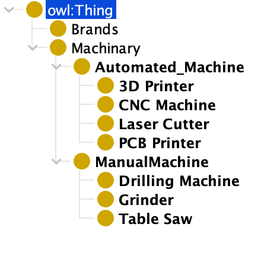

#### オントロジー Individual

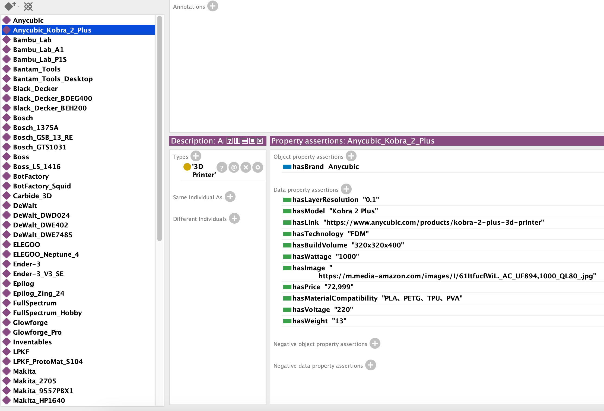

#### オントロジー Property

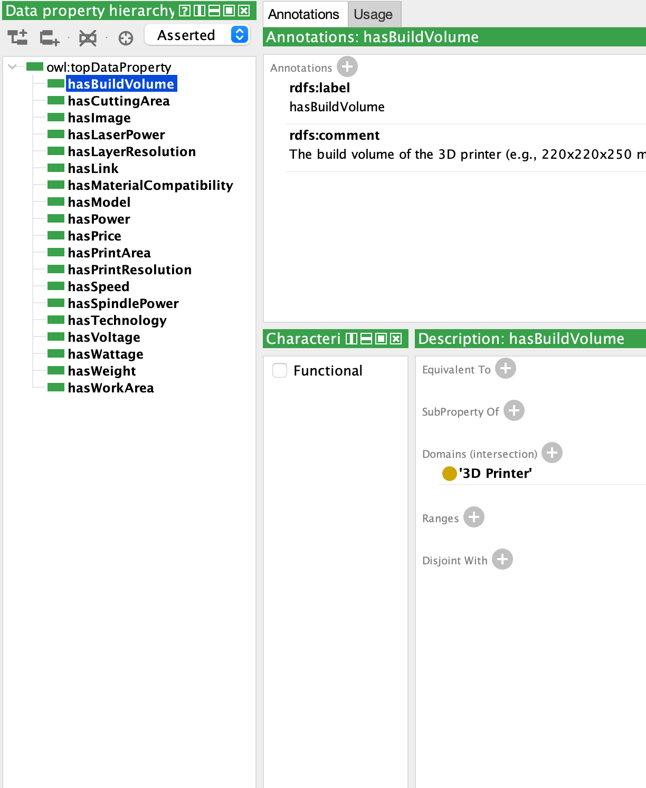
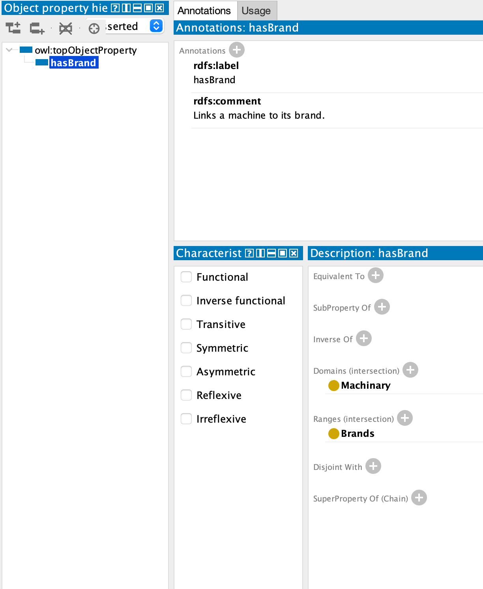

#### オントロジー OntoGraf

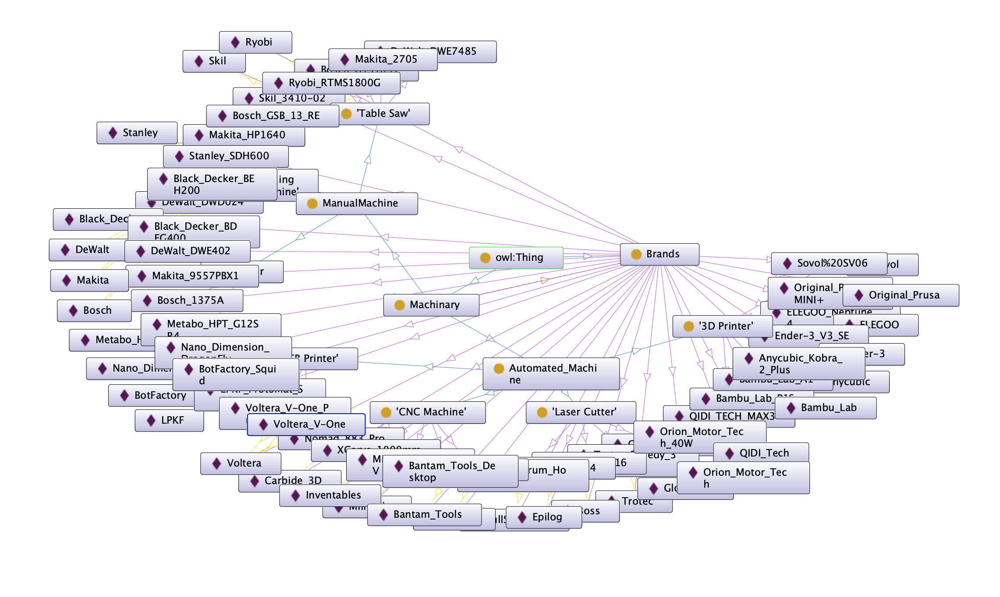

#### オントロジー Sparql Query on Virtuoso「クエリ 01 画面」

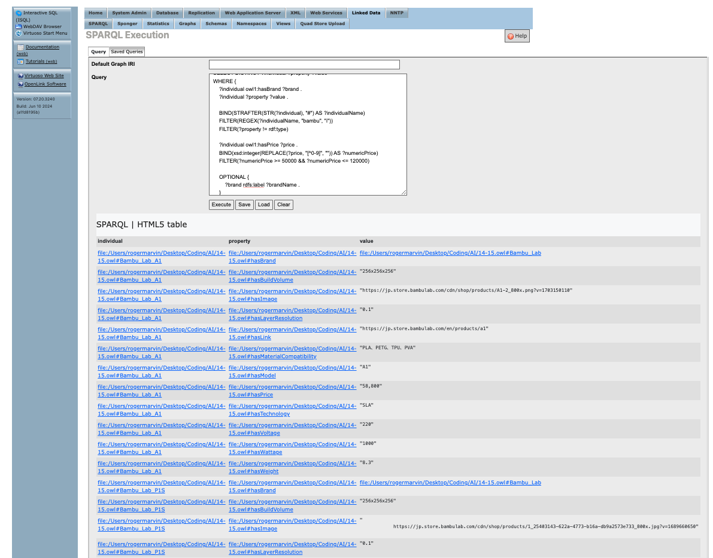

---

### Sparql の実施例とその結果「Virtuoso 環境」

#### クエリ 01 「商品名（インスタンス）でインスタンスのプロパティを検索するクエリ」

> 3D プリンター（入力：「bambu」）の値段が 50,000 円以上 120,000 円以下のものを検索する

```sparql
  PREFIX rdf: <http://www.w3.org/1999/02/22-rdf-syntax-ns#>
  PREFIX rdfs: <http://www.w3.org/2000/01/rdf-schema#>
  PREFIX owl: <http://www.w3.org/2002/07/owl#>
  PREFIX xsd: <http://www.w3.org/2001/XMLSchema#>
  PREFIX owl1: <file:/Users/rogermarvin/Desktop/Coding/AI/14-15.owl#>

  SELECT DISTINCT ?individual ?property ?value
  WHERE {
      ?individual owl1:hasBrand ?brand .
      ?individual ?property ?value .

      BIND(STRAFTER(STR(?individual), "#") AS ?individualName)
      FILTER(REGEX(?individualName, "bambu", "i"))
      FILTER(?property != rdf:type)

      ?individual owl1:hasPrice ?price .
      BIND(xsd:integer(REPLACE(?price, "[^0-9]", "")) AS ?numericPrice)
      FILTER(?numericPrice >= 50000 && ?numericPrice <= 120000)

      OPTIONAL {
          ?brand rdfs:label ?brandName .
      }
  }
  ORDER BY ?individual ?property

```

#### 説明 01

```sparql
PREFIX rdf: <http://www.w3.org/1999/02/22-rdf-syntax-ns#>
PREFIX rdfs: <http://www.w3.org/2000/01/rdf-schema#>
PREFIX owl: <http://www.w3.org/2002/07/owl#>
PREFIX xsd: <http://www.w3.org/2001/XMLSchema#>
PREFIX owl1: <file:/Users/rogermarvin/Desktop/Coding/AI/14-15.owl#>
```

これらの部分は、よく使用される名前空間のプレフィックスを定義します。

```sparql
SELECT DISTINCT ?individual ?property ?value
```

この行は、クエリによって返される変数 (?individual、?property、および ?value) を指定します。
DISTINCT は重複する結果が削除されることを保証します。

```sparql
BIND(STRAFTER(STR(?individual), "#") AS ?individualName)
FILTER(REGEX(?individualName, "bambu", "i"))
FILTER(?property != rdf:type)
```

- 「BIND(STRAFTER(STR(?individual), "#") AS ?individualName)」 は、個体のローカル名 (# の後の部分) を抽出します。
- 「FILTER(REGEX(?individualName, "bambu", "i"))」 は、名前に "bambu" が含まれる個人をフィルタリングします (大文字と小文字は区別されません)。
- 「FILTER(?property != rdf:type)」 は、結果から rdf:type プロパティを除外します。

```sparql
?individual owl1:hasPrice ?price .
BIND(xsd:integer(REPLACE(?price, "[^0-9]", "")) AS ?numericPrice)
FILTER(?numericPrice >= 50000 && ?numericPrice <= 120000)
```

- 「?individual owl1:hasPrice ?price .」 は、hasPrice プロパティを持つ個体と一致します。
- 「BIND(xsd:integer(REPLACE(?price, "[^0-9]", "")) AS ?numericPrice)」 は、価格文字列から数値を抽出します。
- 「FILTER(?numericPrice >= 50000 && ?numericPrice <= 120000)」 は、価格が 50,000 から 120,000 の間にある個体をフィルタリングします。

```sparql
OPTIONAL {
        ?brand rdfs:label ?brandName .
    }
```

- 「OPTIONAL{ ?brand rdfs:label ?brandName . }」 は、ブランドのラベルが存在する場合に一致を試みます。

#### 結果 01

| individual                                                        | property                                                                     | value                                                                                                        |
| ----------------------------------------------------------------- | ---------------------------------------------------------------------------- | ------------------------------------------------------------------------------------------------------------ |
| file:/Users/rogermarvin/Desktop/Coding/AI/14-15.owl#Bambu_Lab_A1  | file:/Users/rogermarvin/Desktop/Coding/AI/14-15.owl#hasBrand                 | file:/Users/rogermarvin/Desktop/Coding/AI/14-15.owl#Bambu_Lab                                                |
| file:/Users/rogermarvin/Desktop/Coding/AI/14-15.owl#Bambu_Lab_A1  | file:/Users/rogermarvin/Desktop/Coding/AI/14-15.owl#hasBuildVolume           | "256x256x256"                                                                                                |
| file:/Users/rogermarvin/Desktop/Coding/AI/14-15.owl#Bambu_Lab_A1  | file:/Users/rogermarvin/Desktop/Coding/AI/14-15.owl#hasImage                 | "https://jp.store.bambulab.com/cdn/shop/products/A1-2_800x.png?v=1703150110"                                 |
| file:/Users/rogermarvin/Desktop/Coding/AI/14-15.owl#Bambu_Lab_A1  | file:/Users/rogermarvin/Desktop/Coding/AI/14-15.owl#hasLayerResolution       | "0.1"                                                                                                        |
| file:/Users/rogermarvin/Desktop/Coding/AI/14-15.owl#Bambu_Lab_A1  | file:/Users/rogermarvin/Desktop/Coding/AI/14-15.owl#hasLink                  | "https://jp.store.bambulab.com/en/products/a1"                                                               |
| file:/Users/rogermarvin/Desktop/Coding/AI/14-15.owl#Bambu_Lab_A1  | file:/Users/rogermarvin/Desktop/Coding/AI/14-15.owl#hasMaterialCompatibility | "PLA、PETG、TPU、PVA"                                                                                        |
| file:/Users/rogermarvin/Desktop/Coding/AI/14-15.owl#Bambu_Lab_A1  | file:/Users/rogermarvin/Desktop/Coding/AI/14-15.owl#hasModel                 | "A1"                                                                                                         |
| file:/Users/rogermarvin/Desktop/Coding/AI/14-15.owl#Bambu_Lab_A1  | file:/Users/rogermarvin/Desktop/Coding/AI/14-15.owl#hasPrice                 | "58,800"                                                                                                     |
| file:/Users/rogermarvin/Desktop/Coding/AI/14-15.owl#Bambu_Lab_A1  | file:/Users/rogermarvin/Desktop/Coding/AI/14-15.owl#hasTechnology            | "SLA"                                                                                                        |
| file:/Users/rogermarvin/Desktop/Coding/AI/14-15.owl#Bambu_Lab_A1  | file:/Users/rogermarvin/Desktop/Coding/AI/14-15.owl#hasVoltage               | "220"                                                                                                        |
| file:/Users/rogermarvin/Desktop/Coding/AI/14-15.owl#Bambu_Lab_A1  | file:/Users/rogermarvin/Desktop/Coding/AI/14-15.owl#hasWattage               | "1000"                                                                                                       |
| file:/Users/rogermarvin/Desktop/Coding/AI/14-15.owl#Bambu_Lab_A1  | file:/Users/rogermarvin/Desktop/Coding/AI/14-15.owl#hasWeight                | "8.3"                                                                                                        |
| file:/Users/rogermarvin/Desktop/Coding/AI/14-15.owl#Bambu_Lab_P1S | file:/Users/rogermarvin/Desktop/Coding/AI/14-15.owl#hasBrand                 | file:/Users/rogermarvin/Desktop/Coding/AI/14-15.owl#Bambu_Lab                                                |
| file:/Users/rogermarvin/Desktop/Coding/AI/14-15.owl#Bambu_Lab_P1S | file:/Users/rogermarvin/Desktop/Coding/AI/14-15.owl#hasBuildVolume           | "256x256x256"                                                                                                |
| file:/Users/rogermarvin/Desktop/Coding/AI/14-15.owl#Bambu_Lab_P1S | file:/Users/rogermarvin/Desktop/Coding/AI/14-15.owl#hasImage                 | https://jp.store.bambulab.com/cdn/shop/products/1_25403143-622a-4773-b16a-db9a2573e733_800x.jpg?v=1689660650 |
| file:/Users/rogermarvin/Desktop/Coding/AI/14-15.owl#Bambu_Lab_P1S | file:/Users/rogermarvin/Desktop/Coding/AI/14-15.owl#hasLayerResolution       | "0.1"                                                                                                        |
| file:/Users/rogermarvin/Desktop/Coding/AI/14-15.owl#Bambu_Lab_P1S | file:/Users/rogermarvin/Desktop/Coding/AI/14-15.owl#hasLink                  | "https://jp.store.bambulab.com/en/products/p1s"                                                              |
| file:/Users/rogermarvin/Desktop/Coding/AI/14-15.owl#Bambu_Lab_P1S | file:/Users/rogermarvin/Desktop/Coding/AI/14-15.owl#hasMaterialCompatibility | "PLA, PETG, TPU, PVA, PET"                                                                                   |
| file:/Users/rogermarvin/Desktop/Coding/AI/14-15.owl#Bambu_Lab_P1S | file:/Users/rogermarvin/Desktop/Coding/AI/14-15.owl#hasModel                 | "P1S"                                                                                                        |
| file:/Users/rogermarvin/Desktop/Coding/AI/14-15.owl#Bambu_Lab_P1S | file:/Users/rogermarvin/Desktop/Coding/AI/14-15.owl#hasPrice                 | "109,000"                                                                                                    |
| file:/Users/rogermarvin/Desktop/Coding/AI/14-15.owl#Bambu_Lab_P1S | file:/Users/rogermarvin/Desktop/Coding/AI/14-15.owl#hasTechnology            | "SLA"                                                                                                        |
| file:/Users/rogermarvin/Desktop/Coding/AI/14-15.owl#Bambu_Lab_P1S | file:/Users/rogermarvin/Desktop/Coding/AI/14-15.owl#hasVoltage               | "220"                                                                                                        |
| file:/Users/rogermarvin/Desktop/Coding/AI/14-15.owl#Bambu_Lab_P1S | file:/Users/rogermarvin/Desktop/Coding/AI/14-15.owl#hasWattage               | "1000"                                                                                                       |
| file:/Users/rogermarvin/Desktop/Coding/AI/14-15.owl#Bambu_Lab_P1S | file:/Users/rogermarvin/Desktop/Coding/AI/14-15.owl#hasWeight                | "9.65"                                                                                                       |

#### クエリ 02「商品カテゴリ（クラス）で商品（インスタンス）のプロパティを検索するクエリ」

> 3D プリンター（入力：「3d」）の値段が 10,000 円以上 120,000 円以下のものを検索する

```sparql
  PREFIX rdf: <http://www.w3.org/1999/02/22-rdf-syntax-ns#>
  PREFIX rdfs: <http://www.w3.org/2000/01/rdf-schema#>
  PREFIX owl: <http://www.w3.org/2002/07/owl#>
  PREFIX xsd: <http://www.w3.org/2001/XMLSchema#>
  PREFIX owl1: <file:/Users/rogermarvin/Desktop/Coding/AI/14-15.owl#>

  SELECT DISTINCT ?individual ?property ?value
  WHERE {
      ?individual rdf:type ?category .
      ?category rdfs:label ?categoryLabel .
      FILTER(CONTAINS(LCASE(STR(?categoryLabel)), LCASE("3d")))

      ?individual owl1:hasBrand ?brand .
      ?individual ?property ?value .
      FILTER(?property != rdf:type)

      ?individual owl1:hasPrice ?price .
      BIND(xsd:integer(REPLACE(?price, "[^0-9]", "")) AS ?numericPrice)
      FILTER(?numericPrice >= 10000 && ?numericPrice <= 120000)

      OPTIONAL {
          ?brand rdfs:label ?brandName .
      }
  }
  ORDER BY ?individual ?property
```

#### 説明 02

```sparql
PREFIX rdf: <http://www.w3.org/1999/02/22-rdf-syntax-ns#>
PREFIX rdfs: <http://www.w3.org/2000/01/rdf-schema#>
PREFIX owl: <http://www.w3.org/2002/07/owl#>
PREFIX xsd: <http://www.w3.org/2001/XMLSchema#>
PREFIX owl1: <file:/Users/rogermarvin/Desktop/Coding/AI/14-15.owl#>
```

これらの部分は、よく使用される名前空間のプレフィックスを定義します。

```sparql
SELECT DISTINCT ?individual ?property ?value
```

この行は、クエリによって返される変数 (?individual、?property、および ?value) を指定します。
DISTINCT は重複する結果が削除されることを保証します。

```sparql
?individual rdf:type ?category .
?category rdfs:label ?categoryLabel .
FILTER(CONTAINS(LCASE(STR(?categoryLabel)), LCASE("3d")))
```

- 「?individual rdf:type ?category .」 は、個体が特定のカテゴリに属することを示します。
- 「?category rdfs:label ?categoryLabel .」 は、カテゴリのラベルを取得します。
- 「FILTER(CONTAINS(LCASE(STR(?categoryLabel)), LCASE("3d")))」 は、カテゴリラベルに "3d" が含まれる個体をフィルタリングします (大文字と小文字は区別されません)。

```sparql
?individual owl1:hasBrand ?brand .
?individual ?property ?value .
FILTER(?property != rdf:type)
```

- 「?individual owl1:hasBrand ?brand .」 は、個体が特定のブランドを持つことを示します。
- 「?individual ?property ?value .」 は、個体のプロパティとその値を取得します。
- 「FILTER(?property != rdf:type)」 は、結果から rdf:type プロパティを除外します。

```sparql
?individual owl1:hasPrice ?price .
BIND(xsd:integer(REPLACE(?price, "[^0-9]", "")) AS ?numericPrice)
FILTER(?numericPrice >= 10000 && ?numericPrice <= 120000)
```

- 「?individual owl1:hasPrice ?price .」 は、hasPrice プロパティを持つ個体と一致します。
- 「BIND(xsd:integer(REPLACE(?price, "[^0-9]", "")) AS ?numericPrice)」 は、価格文字列から数値を抽出します。
- 「FILTER(?numericPrice >= 10000 && ?numericPrice <= 120000)」 は、価格が 10,000 から 120,000 の間にある個体をフィルタリングします。

```sparql
OPTIONAL {
    ?brand rdfs:label ?brandName .
}
```

- 「OPTIONAL{ ?brand rdfs:label ?brandName . }」 は、ブランドのラベルが存在する場合に一致を試みます。

#### 結果 02

| individual                                                                | property                                                                     | value                                                                                                                                                                                                                                                                                                                                             |
| ------------------------------------------------------------------------- | ---------------------------------------------------------------------------- | ------------------------------------------------------------------------------------------------------------------------------------------------------------------------------------------------------------------------------------------------------------------------------------------------------------------------------------------------- |
| file:/Users/rogermarvin/Desktop/Coding/AI/14-15.owl#Anycubic_Kobra_2_Plus | file:/Users/rogermarvin/Desktop/Coding/AI/14-15.owl#hasBrand                 | file:/Users/rogermarvin/Desktop/Coding/AI/14-15.owl#Anycubic                                                                                                                                                                                                                                                                                      |
| file:/Users/rogermarvin/Desktop/Coding/AI/14-15.owl#Anycubic_Kobra_2_Plus | file:/Users/rogermarvin/Desktop/Coding/AI/14-15.owl#hasBuildVolume           | "320x320x400"                                                                                                                                                                                                                                                                                                                                     |
| file:/Users/rogermarvin/Desktop/Coding/AI/14-15.owl#Anycubic_Kobra_2_Plus | file:/Users/rogermarvin/Desktop/Coding/AI/14-15.owl#hasImage                 | "https://m.media-amazon.com/images/I/61ItfucfWiL._AC_UF894,1000_QL80_.jpg"                                                                                                                                                                                                                                                                        |
| file:/Users/rogermarvin/Desktop/Coding/AI/14-15.owl#Anycubic_Kobra_2_Plus | file:/Users/rogermarvin/Desktop/Coding/AI/14-15.owl#hasLayerResolution       | "0.1"                                                                                                                                                                                                                                                                                                                                             |
| file:/Users/rogermarvin/Desktop/Coding/AI/14-15.owl#Anycubic_Kobra_2_Plus | file:/Users/rogermarvin/Desktop/Coding/AI/14-15.owl#hasLink                  | "https://www.anycubic.com/products/kobra-2-plus-3d-printer"                                                                                                                                                                                                                                                                                       |
| file:/Users/rogermarvin/Desktop/Coding/AI/14-15.owl#Anycubic_Kobra_2_Plus | file:/Users/rogermarvin/Desktop/Coding/AI/14-15.owl#hasMaterialCompatibility | "PLA、PETG、TPU、PVA"                                                                                                                                                                                                                                                                                                                             |
| file:/Users/rogermarvin/Desktop/Coding/AI/14-15.owl#Anycubic_Kobra_2_Plus | file:/Users/rogermarvin/Desktop/Coding/AI/14-15.owl#hasModel                 | "Kobra 2 Plus"                                                                                                                                                                                                                                                                                                                                    |
| file:/Users/rogermarvin/Desktop/Coding/AI/14-15.owl#Anycubic_Kobra_2_Plus | file:/Users/rogermarvin/Desktop/Coding/AI/14-15.owl#hasPrice                 | "72,999"                                                                                                                                                                                                                                                                                                                                          |
| file:/Users/rogermarvin/Desktop/Coding/AI/14-15.owl#Anycubic_Kobra_2_Plus | file:/Users/rogermarvin/Desktop/Coding/AI/14-15.owl#hasTechnology            | "FDM"                                                                                                                                                                                                                                                                                                                                             |
| file:/Users/rogermarvin/Desktop/Coding/AI/14-15.owl#Anycubic_Kobra_2_Plus | file:/Users/rogermarvin/Desktop/Coding/AI/14-15.owl#hasVoltage               | "220"                                                                                                                                                                                                                                                                                                                                             |
| file:/Users/rogermarvin/Desktop/Coding/AI/14-15.owl#Anycubic_Kobra_2_Plus | file:/Users/rogermarvin/Desktop/Coding/AI/14-15.owl#hasWattage               | "1000"                                                                                                                                                                                                                                                                                                                                            |
| file:/Users/rogermarvin/Desktop/Coding/AI/14-15.owl#Anycubic_Kobra_2_Plus | file:/Users/rogermarvin/Desktop/Coding/AI/14-15.owl#hasWeight                | "13"                                                                                                                                                                                                                                                                                                                                              |
| file:/Users/rogermarvin/Desktop/Coding/AI/14-15.owl#Bambu_Lab_A1          | file:/Users/rogermarvin/Desktop/Coding/AI/14-15.owl#hasBrand                 | file:/Users/rogermarvin/Desktop/Coding/AI/14-15.owl#Bambu_Lab                                                                                                                                                                                                                                                                                     |
| file:/Users/rogermarvin/Desktop/Coding/AI/14-15.owl#Bambu_Lab_A1          | file:/Users/rogermarvin/Desktop/Coding/AI/14-15.owl#hasBuildVolume           | "256x256x256"                                                                                                                                                                                                                                                                                                                                     |
| file:/Users/rogermarvin/Desktop/Coding/AI/14-15.owl#Bambu_Lab_A1          | file:/Users/rogermarvin/Desktop/Coding/AI/14-15.owl#hasImage                 | "https://jp.store.bambulab.com/cdn/shop/products/A1-2_800x.png?v=1703150110"                                                                                                                                                                                                                                                                      |
| file:/Users/rogermarvin/Desktop/Coding/AI/14-15.owl#Bambu_Lab_A1          | file:/Users/rogermarvin/Desktop/Coding/AI/14-15.owl#hasLayerResolution       | "0.1"                                                                                                                                                                                                                                                                                                                                             |
| file:/Users/rogermarvin/Desktop/Coding/AI/14-15.owl#Bambu_Lab_A1          | file:/Users/rogermarvin/Desktop/Coding/AI/14-15.owl#hasLink                  | "https://jp.store.bambulab.com/en/products/a1"                                                                                                                                                                                                                                                                                                    |
| file:/Users/rogermarvin/Desktop/Coding/AI/14-15.owl#Bambu_Lab_A1          | file:/Users/rogermarvin/Desktop/Coding/AI/14-15.owl#hasMaterialCompatibility | "PLA、PETG、TPU、PVA"                                                                                                                                                                                                                                                                                                                             |
| file:/Users/rogermarvin/Desktop/Coding/AI/14-15.owl#Bambu_Lab_A1          | file:/Users/rogermarvin/Desktop/Coding/AI/14-15.owl#hasModel                 | "A1"                                                                                                                                                                                                                                                                                                                                              |
| file:/Users/rogermarvin/Desktop/Coding/AI/14-15.owl#Bambu_Lab_A1          | file:/Users/rogermarvin/Desktop/Coding/AI/14-15.owl#hasPrice                 | "58,800"                                                                                                                                                                                                                                                                                                                                          |
| file:/Users/rogermarvin/Desktop/Coding/AI/14-15.owl#Bambu_Lab_A1          | file:/Users/rogermarvin/Desktop/Coding/AI/14-15.owl#hasTechnology            | "SLA"                                                                                                                                                                                                                                                                                                                                             |
| file:/Users/rogermarvin/Desktop/Coding/AI/14-15.owl#Bambu_Lab_A1          | file:/Users/rogermarvin/Desktop/Coding/AI/14-15.owl#hasVoltage               | "220"                                                                                                                                                                                                                                                                                                                                             |
| file:/Users/rogermarvin/Desktop/Coding/AI/14-15.owl#Bambu_Lab_A1          | file:/Users/rogermarvin/Desktop/Coding/AI/14-15.owl#hasWattage               | "1000"                                                                                                                                                                                                                                                                                                                                            |
| file:/Users/rogermarvin/Desktop/Coding/AI/14-15.owl#Bambu_Lab_A1          | file:/Users/rogermarvin/Desktop/Coding/AI/14-15.owl#hasWeight                | "8.3"                                                                                                                                                                                                                                                                                                                                             |
| file:/Users/rogermarvin/Desktop/Coding/AI/14-15.owl#Bambu_Lab_P1S         | file:/Users/rogermarvin/Desktop/Coding/AI/14-15.owl#hasBrand                 | file:/Users/rogermarvin/Desktop/Coding/AI/14-15.owl#Bambu_Lab                                                                                                                                                                                                                                                                                     |
| file:/Users/rogermarvin/Desktop/Coding/AI/14-15.owl#Bambu_Lab_P1S         | file:/Users/rogermarvin/Desktop/Coding/AI/14-15.owl#hasBuildVolume           | "256x256x256"                                                                                                                                                                                                                                                                                                                                     |
| file:/Users/rogermarvin/Desktop/Coding/AI/14-15.owl#Bambu_Lab_P1S         | file:/Users/rogermarvin/Desktop/Coding/AI/14-15.owl#hasImage                 | "https://jp.store.bambulab.com/cdn/shop/products/1_25403143-622a-4773-b16a-db9a2573e733_800x.jpg?v=1689660650"                                                                                                                                                                                                                                    |
| file:/Users/rogermarvin/Desktop/Coding/AI/14-15.owl#Bambu_Lab_P1S         | file:/Users/rogermarvin/Desktop/Coding/AI/14-15.owl#hasLayerResolution       | "0.1"                                                                                                                                                                                                                                                                                                                                             |
| file:/Users/rogermarvin/Desktop/Coding/AI/14-15.owl#Bambu_Lab_P1S         | file:/Users/rogermarvin/Desktop/Coding/AI/14-15.owl#hasLink                  | "https://jp.store.bambulab.com/en/products/p1s"                                                                                                                                                                                                                                                                                                   |
| file:/Users/rogermarvin/Desktop/Coding/AI/14-15.owl#Bambu_Lab_P1S         | file:/Users/rogermarvin/Desktop/Coding/AI/14-15.owl#hasMaterialCompatibility | "PLA, PETG, TPU, PVA, PET"                                                                                                                                                                                                                                                                                                                        |
| file:/Users/rogermarvin/Desktop/Coding/AI/14-15.owl#Bambu_Lab_P1S         | file:/Users/rogermarvin/Desktop/Coding/AI/14-15.owl#hasModel                 | "P1S"                                                                                                                                                                                                                                                                                                                                             |
| file:/Users/rogermarvin/Desktop/Coding/AI/14-15.owl#Bambu_Lab_P1S         | file:/Users/rogermarvin/Desktop/Coding/AI/14-15.owl#hasPrice                 | "109,000"                                                                                                                                                                                                                                                                                                                                         |
| file:/Users/rogermarvin/Desktop/Coding/AI/14-15.owl#Bambu_Lab_P1S         | file:/Users/rogermarvin/Desktop/Coding/AI/14-15.owl#hasTechnology            | "SLA"                                                                                                                                                                                                                                                                                                                                             |
| file:/Users/rogermarvin/Desktop/Coding/AI/14-15.owl#Bambu_Lab_P1S         | file:/Users/rogermarvin/Desktop/Coding/AI/14-15.owl#hasVoltage               | "220"                                                                                                                                                                                                                                                                                                                                             |
| file:/Users/rogermarvin/Desktop/Coding/AI/14-15.owl#Bambu_Lab_P1S         | file:/Users/rogermarvin/Desktop/Coding/AI/14-15.owl#hasWattage               | "1000"                                                                                                                                                                                                                                                                                                                                            |
| file:/Users/rogermarvin/Desktop/Coding/AI/14-15.owl#Bambu_Lab_P1S         | file:/Users/rogermarvin/Desktop/Coding/AI/14-15.owl#hasWeight                | "9.65"                                                                                                                                                                                                                                                                                                                                            |
| file:/Users/rogermarvin/Desktop/Coding/AI/14-15.owl#ELEGOO_Neptune_4      | file:/Users/rogermarvin/Desktop/Coding/AI/14-15.owl#hasBrand                 | file:/Users/rogermarvin/Desktop/Coding/AI/14-15.owl#ELEGOO                                                                                                                                                                                                                                                                                        |
| file:/Users/rogermarvin/Desktop/Coding/AI/14-15.owl#ELEGOO_Neptune_4      | file:/Users/rogermarvin/Desktop/Coding/AI/14-15.owl#hasBuildVolume           | "225x225x265"                                                                                                                                                                                                                                                                                                                                     |
| file:/Users/rogermarvin/Desktop/Coding/AI/14-15.owl#ELEGOO_Neptune_4      | file:/Users/rogermarvin/Desktop/Coding/AI/14-15.owl#hasImage                 | "https://m.media-amazon.com/images/S/aplus-media-library-service-media/3572ef63-8c98-4053-b609-5e841619a5c6.__CR0,0,300,225_PT0_SX300_V1___.jpg"                                                                                                                                                                                                  |
| file:/Users/rogermarvin/Desktop/Coding/AI/14-15.owl#ELEGOO_Neptune_4      | file:/Users/rogermarvin/Desktop/Coding/AI/14-15.owl#hasLayerResolution       | "0.1"                                                                                                                                                                                                                                                                                                                                             |
| file:/Users/rogermarvin/Desktop/Coding/AI/14-15.owl#ELEGOO_Neptune_4      | file:/Users/rogermarvin/Desktop/Coding/AI/14-15.owl#hasLink                  | "https://www.amazon.co.jp/ELEGOO-Neptune-Pro-225x225x265mm%C2%B3-8-85x8-85x10-43/dp/B0CG1GGD2T"                                                                                                                                                                                                                                                   |
| file:/Users/rogermarvin/Desktop/Coding/AI/14-15.owl#ELEGOO_Neptune_4      | file:/Users/rogermarvin/Desktop/Coding/AI/14-15.owl#hasMaterialCompatibility | "PLA、PETG、ABS、TPU"                                                                                                                                                                                                                                                                                                                             |
| file:/Users/rogermarvin/Desktop/Coding/AI/14-15.owl#ELEGOO_Neptune_4      | file:/Users/rogermarvin/Desktop/Coding/AI/14-15.owl#hasModel                 | "Neptune 4"                                                                                                                                                                                                                                                                                                                                       |
| file:/Users/rogermarvin/Desktop/Coding/AI/14-15.owl#ELEGOO_Neptune_4      | file:/Users/rogermarvin/Desktop/Coding/AI/14-15.owl#hasPrice                 | "31,199"                                                                                                                                                                                                                                                                                                                                          |
| file:/Users/rogermarvin/Desktop/Coding/AI/14-15.owl#ELEGOO_Neptune_4      | file:/Users/rogermarvin/Desktop/Coding/AI/14-15.owl#hasPrice                 | "100,000"                                                                                                                                                                                                                                                                                                                                         |
| file:/Users/rogermarvin/Desktop/Coding/AI/14-15.owl#ELEGOO_Neptune_4      | file:/Users/rogermarvin/Desktop/Coding/AI/14-15.owl#hasTechnology            | "FDM"                                                                                                                                                                                                                                                                                                                                             |
| file:/Users/rogermarvin/Desktop/Coding/AI/14-15.owl#ELEGOO_Neptune_4      | file:/Users/rogermarvin/Desktop/Coding/AI/14-15.owl#hasVoltage               | "220"                                                                                                                                                                                                                                                                                                                                             |
| file:/Users/rogermarvin/Desktop/Coding/AI/14-15.owl#ELEGOO_Neptune_4      | file:/Users/rogermarvin/Desktop/Coding/AI/14-15.owl#hasWattage               | "1000"                                                                                                                                                                                                                                                                                                                                            |
| file:/Users/rogermarvin/Desktop/Coding/AI/14-15.owl#ELEGOO_Neptune_4      | file:/Users/rogermarvin/Desktop/Coding/AI/14-15.owl#hasWeight                | "8.3"                                                                                                                                                                                                                                                                                                                                             |
| file:/Users/rogermarvin/Desktop/Coding/AI/14-15.owl#Ender-3_V3_SE         | file:/Users/rogermarvin/Desktop/Coding/AI/14-15.owl#hasBrand                 | file:/Users/rogermarvin/Desktop/Coding/AI/14-15.owl#Ender-3                                                                                                                                                                                                                                                                                       |
| file:/Users/rogermarvin/Desktop/Coding/AI/14-15.owl#Ender-3_V3_SE         | file:/Users/rogermarvin/Desktop/Coding/AI/14-15.owl#hasBuildVolume           | "220x220x250"                                                                                                                                                                                                                                                                                                                                     |
| file:/Users/rogermarvin/Desktop/Coding/AI/14-15.owl#Ender-3_V3_SE         | file:/Users/rogermarvin/Desktop/Coding/AI/14-15.owl#hasImage                 | "https://www.creality3dofficial.eu/files/goods/20230925/creality-ender-3v3-se-3d-printer-eu.jpg"                                                                                                                                                                                                                                                  |
| file:/Users/rogermarvin/Desktop/Coding/AI/14-15.owl#Ender-3_V3_SE         | file:/Users/rogermarvin/Desktop/Coding/AI/14-15.owl#hasLayerResolution       | "0.1"                                                                                                                                                                                                                                                                                                                                             |
| file:/Users/rogermarvin/Desktop/Coding/AI/14-15.owl#Ender-3_V3_SE         | file:/Users/rogermarvin/Desktop/Coding/AI/14-15.owl#hasLink                  | "https://www.amazon.co.jp/Creality-Ender-3-s%E3%81%BE%E3%81%A7%E3%82%B9%E3%83%94%E3%83%BC%E3%83%88%E3%81%A82500mm-%E3%83%8F%E3%83%B3%E3%82%BA%E3%83%95%E3%83%AA%E3%83%BC%E8%87%AA%E5%8B%95%E3%83%AC%E3%83%99%E3%83%AA%E3%83%B3%E3%82%B0-%E9%AB%98%E7%B2%BE%E5%BA%A6%E9%80%A0%E5%BD%A2%E3%82%B5%E3%82%A4%E3%82%BA220x220x250mm/dp/B0CDGL637K?th=1" |
| file:/Users/rogermarvin/Desktop/Coding/AI/14-15.owl#Ender-3_V3_SE         | file:/Users/rogermarvin/Desktop/Coding/AI/14-15.owl#hasMaterialCompatibility | "PLA、PETG、TPU"                                                                                                                                                                                                                                                                                                                                  |
| file:/Users/rogermarvin/Desktop/Coding/AI/14-15.owl#Ender-3_V3_SE         | file:/Users/rogermarvin/Desktop/Coding/AI/14-15.owl#hasModel                 | "V3_SE"                                                                                                                                                                                                                                                                                                                                           |
| file:/Users/rogermarvin/Desktop/Coding/AI/14-15.owl#Ender-3_V3_SE         | file:/Users/rogermarvin/Desktop/Coding/AI/14-15.owl#hasPrice                 | "27,427"                                                                                                                                                                                                                                                                                                                                          |
| file:/Users/rogermarvin/Desktop/Coding/AI/14-15.owl#Ender-3_V3_SE         | file:/Users/rogermarvin/Desktop/Coding/AI/14-15.owl#hasTechnology            | "SLA"                                                                                                                                                                                                                                                                                                                                             |
| file:/Users/rogermarvin/Desktop/Coding/AI/14-15.owl#Ender-3_V3_SE         | file:/Users/rogermarvin/Desktop/Coding/AI/14-15.owl#hasVoltage               | "220"                                                                                                                                                                                                                                                                                                                                             |
| file:/Users/rogermarvin/Desktop/Coding/AI/14-15.owl#Ender-3_V3_SE         | file:/Users/rogermarvin/Desktop/Coding/AI/14-15.owl#hasWattage               | "1000"                                                                                                                                                                                                                                                                                                                                            |
| file:/Users/rogermarvin/Desktop/Coding/AI/14-15.owl#Ender-3_V3_SE         | file:/Users/rogermarvin/Desktop/Coding/AI/14-15.owl#hasWeight                | "7.34"                                                                                                                                                                                                                                                                                                                                            |
| rogermarvin/Desktop/Coding/AI/14-15.owl#Original_Prusa_MINI+              | file:/Users/rogermarvin/Desktop/Coding/AI/14-15.owl#hasBrand                 | file:/Users/rogermarvin/Desktop/Coding/AI/14-15.owl#Prusa                                                                                                                                                                                                                                                                                         |
| file:/Users/rogermarvin/Desktop/Coding/AI/14-15.owl#Original_Prusa_MINI+  | file:/Users/rogermarvin/Desktop/Coding/AI/14-15.owl#hasBuildVolume           | "180x180x180"                                                                                                                                                                                                                                                                                                                                     |
| file:/Users/rogermarvin/Desktop/Coding/AI/14-15.owl#Original_Prusa_MINI+  | file:/Users/rogermarvin/Desktop/Coding/AI/14-15.owl#hasImage                 | "https://m.media-amazon.com/images/I/71vFaWXP9hL.jpg"                                                                                                                                                                                                                                                                                             |
| file:/Users/rogermarvin/Desktop/Coding/AI/14-15.owl#Original_Prusa_MINI+  | file:/Users/rogermarvin/Desktop/Coding/AI/14-15.owl#hasLayerResolution       | "0.1"                                                                                                                                                                                                                                                                                                                                             |
| file:/Users/rogermarvin/Desktop/Coding/AI/14-15.owl#Original_Prusa_MINI+  | file:/Users/rogermarvin/Desktop/Coding/AI/14-15.owl#hasLink                  | "https://www.amazon.co.jp/ORIGINAL-PRUSA-MINI-%E5%8D%8A%E7%B5%84%E7%AB%8B%E6%B8%88%E3%81%BF/dp/B0933LV2JW"                                                                                                                                                                                                                                        |
| file:/Users/rogermarvin/Desktop/Coding/AI/14-15.owl#Original_Prusa_MINI+  | file:/Users/rogermarvin/Desktop/Coding/AI/14-15.owl#hasMaterialCompatibility | "PLA, PETG, ASA, ABS, PC (Polycarbonate), CPE, PVA/BVOH, PVB, HIPS, PP (Polypropylene), Flex, nGen, Nylon, Woodfill"                                                                                                                                                                                                                              |
| file:/Users/rogermarvin/Desktop/Coding/AI/14-15.owl#Original_Prusa_MINI+  | file:/Users/rogermarvin/Desktop/Coding/AI/14-15.owl#hasModel                 | "MINI+"                                                                                                                                                                                                                                                                                                                                           |
| file:/Users/rogermarvin/Desktop/Coding/AI/14-15.owl#Original_Prusa_MINI+  | file:/Users/rogermarvin/Desktop/Coding/AI/14-15.owl#hasPrice                 | "27,427"                                                                                                                                                                                                                                                                                                                                          |
| file:/Users/rogermarvin/Desktop/Coding/AI/14-15.owl#Original_Prusa_MINI+  | file:/Users/rogermarvin/Desktop/Coding/AI/14-15.owl#hasPrice                 | "100,000"                                                                                                                                                                                                                                                                                                                                         |
| file:/Users/rogermarvin/Desktop/Coding/AI/14-15.owl#Original_Prusa_MINI+  | file:/Users/rogermarvin/Desktop/Coding/AI/14-15.owl#hasTechnology            | "FDM"                                                                                                                                                                                                                                                                                                                                             |
| file:/Users/rogermarvin/Desktop/Coding/AI/14-15.owl#Original_Prusa_MINI+  | file:/Users/rogermarvin/Desktop/Coding/AI/14-15.owl#hasVoltage               | "220"                                                                                                                                                                                                                                                                                                                                             |
| file:/Users/rogermarvin/Desktop/Coding/AI/14-15.owl#Original_Prusa_MINI+  | file:/Users/rogermarvin/Desktop/Coding/AI/14-15.owl#hasWattage               | "1000"                                                                                                                                                                                                                                                                                                                                            |
| file:/Users/rogermarvin/Desktop/Coding/AI/14-15.owl#Original_Prusa_MINI+  | file:/Users/rogermarvin/Desktop/Coding/AI/14-15.owl#hasWeight                | "4.5"                                                                                                                                                                                                                                                                                                                                             |
| file:/Users/rogermarvin/Desktop/Coding/AI/14-15.owl#Sovol%20SV06          | file:/Users/rogermarvin/Desktop/Coding/AI/14-15.owl#hasBrand                 | file:/Users/rogermarvin/Desktop/Coding/AI/14-15.owl#Sovol                                                                                                                                                                                                                                                                                         |
| file:/Users/rogermarvin/Desktop/Coding/AI/14-15.owl#Sovol%20SV06          | file:/Users/rogermarvin/Desktop/Coding/AI/14-15.owl#hasBuildVolume           | "220x220x250"                                                                                                                                                                                                                                                                                                                                     |
| file:/Users/rogermarvin/Desktop/Coding/AI/14-15.owl#Sovol%20SV06          | file:/Users/rogermarvin/Desktop/Coding/AI/14-15.owl#hasImage                 | "https://m.media-amazon.com/images/I/718XUIjydqL.jpg"                                                                                                                                                                                                                                                                                             |
| file:/Users/rogermarvin/Desktop/Coding/AI/14-15.owl#Sovol%20SV06          | file:/Users/rogermarvin/Desktop/Coding/AI/14-15.owl#hasLayerResolution       | "0.1"                                                                                                                                                                                                                                                                                                                                             |
| file:/Users/rogermarvin/Desktop/Coding/AI/14-15.owl#Sovol%20SV06          | file:/Users/rogermarvin/Desktop/Coding/AI/14-15.owl#hasLink                  | "https://www.amazon.com/Sovol-Planetary-Extruder-25-Point-8-66x8-66x9-84/dp/B0BJV3WB2J"                                                                                                                                                                                                                                                           |
| file:/Users/rogermarvin/Desktop/Coding/AI/14-15.owl#Sovol%20SV06          | file:/Users/rogermarvin/Desktop/Coding/AI/14-15.owl#hasMaterialCompatibility | "PLA、PETG、TPU、PVA"                                                                                                                                                                                                                                                                                                                             |
| file:/Users/rogermarvin/Desktop/Coding/AI/14-15.owl#Sovol%20SV06          | file:/Users/rogermarvin/Desktop/Coding/AI/14-15.owl#hasModel                 | "SV06"                                                                                                                                                                                                                                                                                                                                            |
| file:/Users/rogermarvin/Desktop/Coding/AI/14-15.owl#Sovol%20SV06          | file:/Users/rogermarvin/Desktop/Coding/AI/14-15.owl#hasPrice                 | "30,492"                                                                                                                                                                                                                                                                                                                                          |
| file:/Users/rogermarvin/Desktop/Coding/AI/14-15.owl#Sovol%20SV06          | file:/Users/rogermarvin/Desktop/Coding/AI/14-15.owl#hasPrice                 | "100,000"                                                                                                                                                                                                                                                                                                                                         |
| file:/Users/rogermarvin/Desktop/Coding/AI/14-15.owl#Sovol%20SV06          | file:/Users/rogermarvin/Desktop/Coding/AI/14-15.owl#hasTechnology            | "FDM"                                                                                                                                                                                                                                                                                                                                             |
| file:/Users/rogermarvin/Desktop/Coding/AI/14-15.owl#Sovol%20SV06          | file:/Users/rogermarvin/Desktop/Coding/AI/14-15.owl#hasVoltage               | "220"                                                                                                                                                                                                                                                                                                                                             |
| file:/Users/rogermarvin/Desktop/Coding/AI/14-15.owl#Sovol%20SV06          | file:/Users/rogermarvin/Desktop/Coding/AI/14-15.owl#hasWattage               | "1000"                                                                                                                                                                                                                                                                                                                                            |
| file:/Users/rogermarvin/Desktop/Coding/AI/14-15.owl#Sovol%20SV06          | file:/Users/rogermarvin/Desktop/Coding/AI/14-15.owl#hasWeight                | "10.5"                                                                                                                                                                                                                                                                                                                                            |

---

#### その他クエリ（クエリ実行のその他のパターン）

##### 1. すべてのクラスを一覧表示する

```
PREFIX rdf: <http://www.w3.org/1999/02/22-rdf-syntax-ns#>
PREFIX owl: <http://www.w3.org/2002/07/owl#>

SELECT ?class
WHERE {
  ?class rdf:type owl:Class .
}
```

##### 2. すべてのオブジェクトプロパティを一覧表示する

```
PREFIX rdf: <http://www.w3.org/1999/02/22-rdf-syntax-ns#>
PREFIX owl: <http://www.w3.org/2002/07/owl#>

SELECT ?property
WHERE {
  ?property rdf:type owl:ObjectProperty .
}
```

##### 3. すべてのデータプロパティを一覧表示する

```
PREFIX rdf: <http://www.w3.org/1999/02/22-rdf-syntax-ns#>
PREFIX owl: <http://www.w3.org/2002/07/owl#>

SELECT ?property
WHERE {
  ?property rdf:type owl:DatatypeProperty .
}
```

##### 4. すべてのAnnotationプロパティを一覧表示する

```
PREFIX rdf: <http://www.w3.org/1999/02/22-rdf-syntax-ns#>
PREFIX owl: <http://www.w3.org/2002/07/owl#>

SELECT ?property
WHERE {
  ?property rdf:type owl:AnnotationProperty .
}
```

##### 5. すべてのインスタンスをリストする

```
PREFIX rdf: <http://www.w3.org/1999/02/22-rdf-syntax-ns#>
PREFIX owl: <http://www.w3.org/2002/07/owl#>

SELECT ?individual
WHERE {
  ?individual rdf:type owl:NamedIndividual .
}
```


#####  6. 特定の個体のすべてのプロパティを一覧表示する「Anycubic Kobra 2 Plusの場合」
```sparql
PREFIX rdf: <http://www.w3.org/1999/02/22-rdf-syntax-ns#>
PREFIX owl: <http://www.w3.org/2002/07/owl#>

SELECT ?property ?value
WHERE {
  <file:/Users/rogermarvin/Desktop/Coding/AI/14-15.owl#Anycubic_Kobra_2_Plus> ?property ?value .
}
```

#####  7. 特定のクラスのすべての個体をリストします「3DPrinterの場合」
```sparql
PREFIX rdf: <http://www.w3.org/1999/02/22-rdf-syntax-ns#>
PREFIX owl: <http://www.w3.org/2002/07/owl#>

SELECT ?individual
WHERE {
  ?individual rdf:type <file:/Users/rogermarvin/Desktop/Coding/AI/14-15.owl#3DPrinter> .
}
```

#####  ８. すべてのクラスとそのサブクラスを一覧表示します
```sparql
PREFIX rdf: <http://www.w3.org/1999/02/22-rdf-syntax-ns#>
PREFIX rdfs: <http://www.w3.org/2000/01/rdf-schema#>

SELECT ?class ?subclass
WHERE {
  ?subclass rdfs:subClassOf ?class .
}
```


### 作成したオントロジの規模、その活用規模を表す数値を列挙する

- 設計したクラスの数
- 設計したインスタンスの数
- 設計したプロパティの数
- .owl ファイルの行数 (XML ファイルの行数を wc でカウント、テキストエディタで確認)
- Sparql のクエリ数　（クエリ実行のパターン数）
- トータルの Sparql 行数

| 定量パラメタ    | 数値 |
| --------------- | ---- |
| クラス数        | 11   |
| インスタンス数  | 69   |
| プロパティ数    | 21   |
| .owl 行数       | 1454 |
| Sparql クエリ数 | 10    |
| Sparql 行数     | 89   |

### 分析・評価・考察

- 選定理由、なぜこのテーマを選定したか？
- 深く専門的な知識の所在
- ユーザへの寄与・貢献、ユーザにどのように活用してほしいか
- 差異化要素、強みと特徴点
- 共通語彙、プロパティの使い方で自ら発見した知見
- クラスとインスタンスの違いで発見した知見
- オントロジ設計で貫いたポリシー
- 創意工夫のポイント
- オントロジエディタの使い方で習得した技法
- 作業を通じて得られた知見

### 評価の観点

- 独創性と丁寧な設計
- 差異化性（既存と異なる付加価値）
- 深さ　（表面的でなく、知識に深みがある）
- 設計思想　（どのような思いでデザインしたか）
- 見通しの良さ、設計のわかりやすさ
- is-a, has-a, 主語・述語・目的語の簡明さ
- 共通語彙の活用度
- Sparql の量・質・複雑さ・多様さ

### AI 実習全体を振り返り、考察・分析・展望

- AI 実習（知識工学系）で得た知見を今後どのように活用するか
- 具体的な知識データの活用方法
- 機械学習、生成系 AI との効果的な連携方法

<!--  自由記述欄 -->

| 目次                                                      | 説明                                                                                                                                                                                                                                                        |
| :-------------------------------------------------------- | :---------------------------------------------------------------------------------------------------------------------------------------------------------------------------------------------------------------------------------------------------------- |
| AI 実習（知識工学系）で得た知見を今後どのように活用するか | これから様々なハッカソンや開発に参加する予定です。その際に、この講義で学んだ内容を実際の開発に活かし、オントロジーを利用することで効果的に取り組みたいと思います。                                                                                          |
| 具体的な知識データの活用方法                              | 　例えば、最終レポートでは、自分は実際にただオントロジーまでジャなくて、実際に目に見やすくフロントを開発しました。それは機械の検索するサービスです。他の案は、実際に自分の AI を作ることや多言語の辞書を作ることなどを想定しています。                      |
| 機械学習、生成系 AI との効果的な連携方法                  | 実際にオントロジーと連携した後、自分の感想は「すごい、早い」というものでした。普通の API とは異なり、オントロジーと連携すると検索速度が非常に速いです。方法としては、Virtuoso のようなサービスを利用して、自分のオントロジーの API を取得し、連携しました。 |

---

### 第 13 回グループ課題の要約・整理

| 回数 |  グループ名  | 発表者    | 発表内容                                                                                                                                                                                                                                | 発表への質疑・コメント                                                                                                                                                        |
| :--: | :----------: | --------- | --------------------------------------------------------------------------------------------------------------------------------------------------------------------------------------------------------------------------------------- | ----------------------------------------------------------------------------------------------------------------------------------------------------------------------------- |
|  13  | **青雲の志** | 竹田 勇斗 | 家電に関するオントロジを構築。扇風機等をクラスとして定義し、販売元 URL も含めた。時間の制約から高度なクエリ作成には至らなかったが、2 つのインスタンスのデータプロパティと概要を出力するクエリを実行。次回授業の準備も兼ねて取り組んだ。 | Q: グループ内での役割分担は？ A: クエリ設計、全体統括など、メンバー間で分担して作業を進めた。                                                                                 |
|  13  | **破竹の勢** | 倉石 大輝 | Wikidata のプログラミング言語データに対し、Python を用いてクエリを実行。ランダムに 10 個のサブジェクトを抽出し、選択したサブジェクトの述語を表示するプログラムを作成。例として「Java」の所有者を述語として表示した。                    | Q: 「所有者」は権利保有者を指すのか？ A: サブジェクトがランダムに選ばれるため、結果の正確性は保証できない。事実確認は行っていない。                                           |
|  13  | **飛龍在天** | 大竹 啓之 | Wikidata のポケモンデータを利用し、世代別クエリを実行。地域ごとのポケモンタイプ表示を目指したが、第 9 世代ポケモンの表示にとどまった。今後、ラベルでの検索機能実装を計画。                                                              | Q: 述語での検索が課題だったか？ A: その通りです。                                                                                                                             |
|  13  | **鵬程万里** | 小柳 怜   | 小柳: 地域別の山を標高順に表示。小出: Wikidata のポケモンデータで連結表示を実施。特定ポケモンの詳細表示を試みた。安達: DBpedia を用いて「研音」所属俳優の情報を生年別に表示。主要作品情報も Wikipedia から取得して表示。                | Q: 最高峰は？ A: 東北の燧ヶ岳。Q: ポケモンタイプの表示方法は？ A: タイプラベルと連結表示を使用。Q: 「テレビドラマ」表示は必要？ A: Wikipedia 由来の不要な情報。今後除外予定。 |
|  13  | **金剛不壊** | 相場 陸   | プログラミング言語に関するクエリを実行。2000 年以降に誕生した静的型付け言語を抽出。個別言語の詳細クエリは未完成。                                                                                                                       | Q: 抽出された言語で使用経験はあるか？ A: 「Go」言語の使用経験あり。Q: クエリの工夫点は？ A: 不要な ID の表示を除外するよう調整した。                                          |
|  13  | **磐石之固** | 加藤 颯士 | ポケモンオントロジを拡張し、「特性」と「進化方法」を追加。「しんりょく」特性を持つポケモンや、「ほのおのいし」で進化するポケモンを抽出し、進化前後の関係を一覧表示するクエリを実装。                                                    | Q: 道具進化とレベルアップ進化の両方がある場合の表示は？ A: 進化方法は一つのみなので、複数表示の必要はない。                                                                   |

---

### 第 14 回グループ課題の要約・整理

| 回数 |  グループ名  | 発表者                             | 発表内容                                                                                                                                                                                                                                                                                                                                                                                                                                                                    | 発表への質疑・コメント                                                                                                                                                                                                                                                                                                                           |
| :--: | :----------: | ---------------------------------- | --------------------------------------------------------------------------------------------------------------------------------------------------------------------------------------------------------------------------------------------------------------------------------------------------------------------------------------------------------------------------------------------------------------------------------------------------------------------------- | ------------------------------------------------------------------------------------------------------------------------------------------------------------------------------------------------------------------------------------------------------------------------------------------------------------------------------------------------ |
|  14  | **青雲の志** |                                    |                                                                                                                                                                                                                                                                                                                                                                                                                                                                             |                                                                                                                                                                                                                                                                                                                                                  |
|  14  | **破竹の勢** |                                    |                                                                                                                                                                                                                                                                                                                                                                                                                                                                             |                                                                                                                                                                                                                                                                                                                                                  |
|  14  | **飛龍在天** | 大竹啓之                           | この班の発表内容は主にスピーカーのオントロジー。メーカーや機械の情報をクラスとして設定していると報告しました。連携機能がついているかなどを今後追加していきたいと考えていますが、どの層に向けての商品なのかを分けて制作していきます。SPARQL の検索はスピーカーを買いに来たらイヤホンやマイクが欲しくなることを想定して情報を追加したいと思っている。                                                                                                                         | お風呂で使えるスピーカーの選び方についての情報を検索できるようにしたいです。また、スマートスピーカーの消費電力についての情報も記載できると助かります。                                                                                                                                                                                           |
|  14  | **鵬程万里** |                                    |                                                                                                                                                                                                                                                                                                                                                                                                                                                                             |                                                                                                                                                                                                                                                                                                                                                  |
|  14  | **金剛不壊** | Roger Marvin                       | 機器のオントロジーに関して、開志ラボにある機器を自動化された機械と手動の機械に分類し、HTML や JavaScript を使ってデータを検索できるようにします                                                                                                                                                                                                                                                                                                                             | Q: マニュアルと自動的で分けたと合ったが、人の手で動かすものと自動的に動かす物という解釈で合ってるか。A: 実際に手を動かして行うものなので、作業自体の方法によって区別しています。Q: どういうスパークルを考えたか。A: クラスを抽出して、それに属するインスタンスや、インスタンスから関連するクラスを調査するためのスパークルクエリを考えています。 |
|  14  | **磐石之固** | 五十嵐 寛人, 池田 侑哉, 駒木根道元 | 五十嵐: イヤホンのオントロジー。クラス: 種類、特徴、機能。スパークルでの検索は Apple の製品を検索すると価格などの情報を入れている。サイズや色などの情報も追加したい。池田: カメラのプロに向けてのオントロジー。クラス: カメラの名前、カメラの情報（メーカー、値段、ボディ色、画素数、レンズマウントなど）を含む。駒木根: 冷蔵庫について。お金持ちで奥さんが料理好きな素人を想定。クラス: メーカー、機能、色、価格。スパークルの検索は価格を無視して行うことを想定している。 | 五十嵐: Q: プロだったらどのようにスパークル検索をするのか。A: 動物を撮る場合だったらプレ防止などが重要なので、その段階ごとに検索をすることを想定している。駒木根: Q: 価格以外に選ぶ要素はあるのか。A: 冷蔵庫の機能で選べるようにする。Is-a、has-a 関係をしっかり記述する。                                                                       |

---

### 第 15 回グループ課題の要約・整理

| 回数 | グループ名 | 発表者                        | 発表内容                                                                                                                                   | 発表への質疑・コメント                                                                                                                                                                          |
| :--: | :--------: | ----------------------------- | ------------------------------------------------------------------------------------------------------------------------------------------ | ----------------------------------------------------------------------------------------------------------------------------------------------------------------------------------------------- |
|  15  |  青雲の志  | 竹田 勇斗                     | モニターと周辺機器のオントロジを作成。現時点ではモニター関連のみ実装。データプロパティを充実させた点が特徴。                               | Q: 複合検索は可能か？ A: はい、複数条件での検索を実装済み。プロパティの充実は良いアプローチだと評価された。                                                                                     |
|  15  |  破竹の勢  | 倉石 大暉                     | キーボードに関するオントロジを構築。配列、スイッチタイプ、規格の違いなど、多様なクラスを設定。キータイプ検索機能を実装。                   | Q: キーキャップの位置による重さの違いは記述されているか？ A: 未実装だが、今後データプロパティを追加して対応予定。Q: 足用キーボードは考慮しているか？ A: 現時点では想定外。                      |
|  15  |  飛龍在天  | 大竹 啓之, 阿部 一成, 川崎 宝 | スピーカー・イヤホン、スマートフォンに関する複数のオントロジを発表。ブランドごとのインスタンス設定や、スマホ初心者向けの情報構築を目指す。 | Q: スマホオントロジの重複をどう扱うか？ A: 検索対象ユーザーを分けて作成する方針。内蔵メモリや CPU 情報の追加、ターゲットとオントロジの整合性向上が課題として指摘された。                        |
|  15  |  鵬程万里  | 安達 萌衣                     | コスメ、特にアイシャドウに特化したオントロジを作成。肌の色に合わせた製品検索を目指す。形状ごとのクラス分けを実施。                         | Q: 肌の種類は 4 種類で十分か？ A: 暖色系・寒色系それぞれ 2 種類を想定。型番でのグルーピングによる情報の簡潔化が提案された。                                                                     |
|  15  |  金剛不壊  | ロジャー                      | 開志ラボ用の検索エンジン「Nier」を開発。施設管理者向けに、機器の購入・利用情報を提供。自作オントロジと API を活用。                        | Q: ハンダゴテの使用可否情報は？ A: 現在は管理者向け購入情報が中心。Q: 新規購入希望商品の扱いは？ A: 購入・カテゴリボタンの追加を検討中。詳細な条件設定の難しさが課題として挙げられた。          |
|  15  |  磐石之固  | 加藤 颯士, 五十嵐 寛人        | たこ焼き機とイヤホンのオントロジをそれぞれ発表。商品名、メーカー、特徴などを詳細に記述。検索機能の実装も進めている。                       | たこ焼き機：Q: 想定ユーザーと検索方法は？ A: 長所、サイズ、価格などで検索可能。ユーザーニーズの明確化が課題。イヤホン：価格でのフィルタリングが評価された。より複雑なクエリの実装が期待される。 |

---

### [自己成長、成果、上位成績に向けて]　個人成果の報告　

> 最終レポートに向けて、自分が機械の検索オントロジーを作りました。自分がただオンとロジーを作るだけではなくて、実際にそのオントロジーと自分が開発するものをれけいしたいと思うから、チャレンジしました。実際にできるかどうか全く知らなくて、とりあえず挑戦して、その結果、うまくできました。
> 以下ではそのサービスの説明です。

### サービスの詳細

#### サービス概要

| 目次             | 説明                                                                                                                                                                                                             |
| :--------------- | :--------------------------------------------------------------------------------------------------------------------------------------------------------------------------------------------------------------- |
| テーマ           | 開志ラボ機械検索サービス                                                                                                                                                                                         |
| 選んだ理由       | 開志ラボである機械を自分が書いたい時や開志ラボのような施設の管理者や利用者が機械の情報を調べるときに、一個一個探さなくても、このサービスを利用して、加速で機械の重要な情報を調べられるようにしたいと思ったから。 |
| 想定するユーザー | 機械が好きな人、開志のような施設の利用者または管理者、機械に関して詳しくない人でも使います。                                                                                                                     |

#### サービス説明

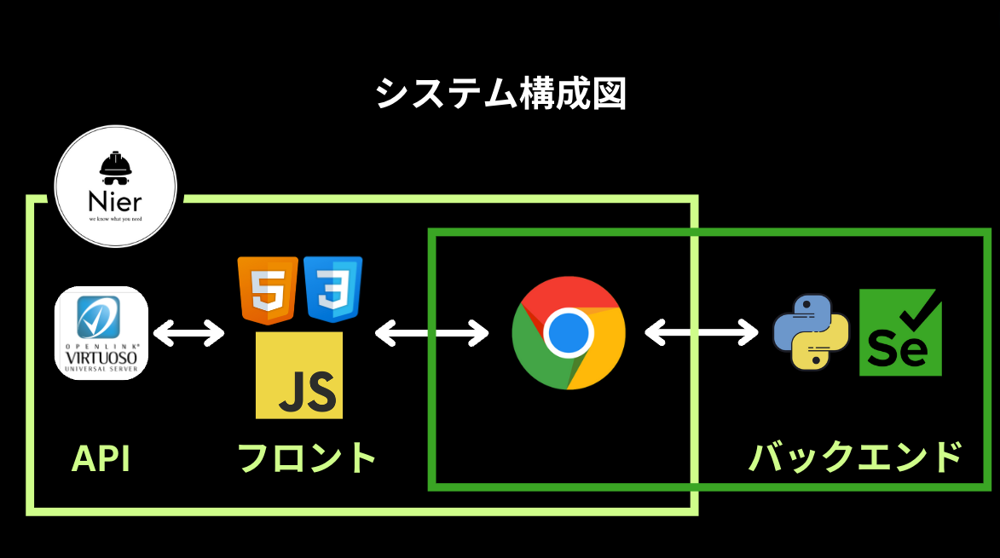

#### 商品名で検索してみる

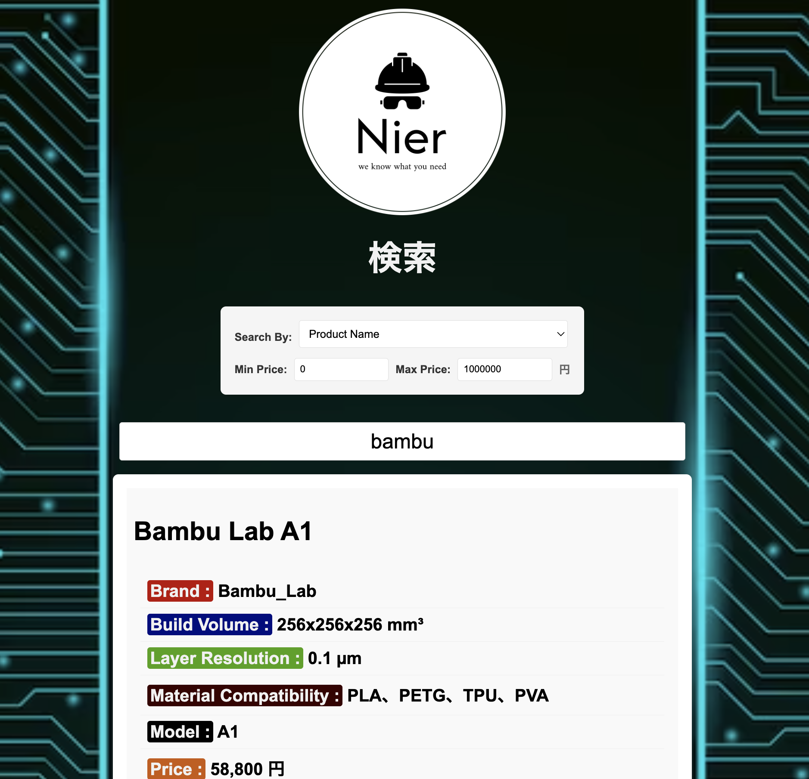
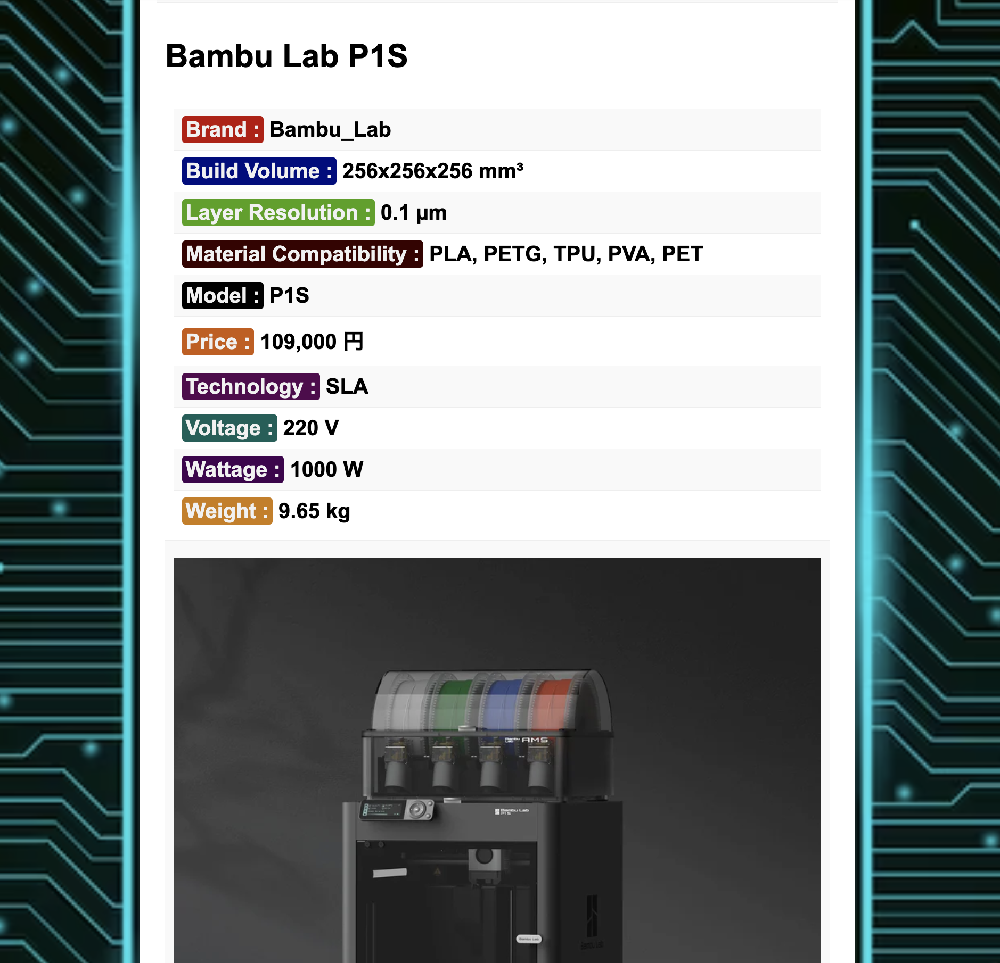

#### 商品のカテゴリで検索してみる

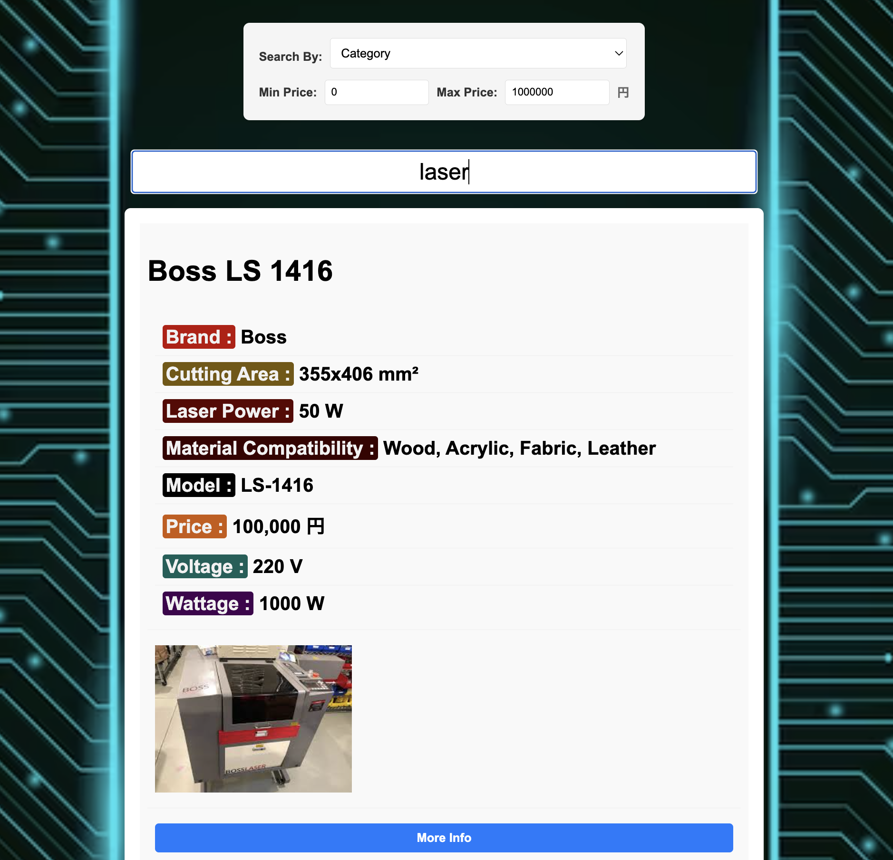
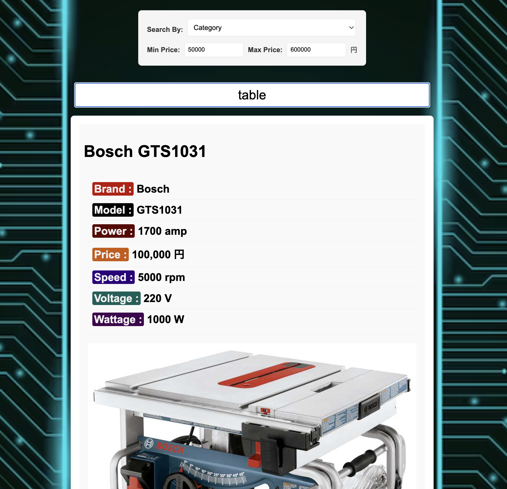

#### ソースコード

##### HTML＆CSS「シンプルな HTML」

```html
<!DOCTYPE html>
<html lang="en">
  <head>
    <meta charset="UTF-8" />
    <title>開志ラボ機械ガイド</title>
    <link rel="stylesheet" href="styles.css" />
    <script src="script.js" defer></script>
  </head>
  <body>
    <div class="logo"></div>
    <h1>検索</h1>
    <div class="filter-container">
      <div class="search-by">
        <p>Search By:</p>
        <select id="searchType">
          <option value="productName">Product Name</option>
          <option value="category">Category</option>
        </select>
      </div>
      <div class="price-range">
        <label for="minPrice">Min Price:</label>
        <input
          type="number"
          id="minPrice"
          min="0"
          max="1000000"
          step="1000"
          value="0"
        />
        <label for="maxPrice">Max Price:</label>
        <input
          type="number"
          id="maxPrice"
          min="0"
          max="1000000"
          step="1000"
          value="1000000"
        />
        <span>円</span>
      </div>
    </div>
    <input
      type="text"
      id="individualInput"
      placeholder="Enter product name or category"
    />
    <div id="results">Nothing here...</div>
  </body>
</html>
```

##### JavaScript「オントロジーの API と連携して、SPARQL クエリでやり取りする」

```javascript
async function querySPARQL(searchInput, searchType, minPrice, maxPrice) {
  let query;
  if (searchType === "productName") {
    query = `
            PREFIX rdf: <http://www.w3.org/1999/02/22-rdf-syntax-ns#>
            PREFIX rdfs: <http://www.w3.org/2000/01/rdf-schema#>
            PREFIX owl: <http://www.w3.org/2002/07/owl#>
            PREFIX xsd: <http://www.w3.org/2001/XMLSchema#>
            PREFIX owl1: <file:/Users/rogermarvin/Desktop/Coding/AI/14-15.owl#>

            SELECT DISTINCT ?individual ?property ?value
            WHERE {
                ?individual owl1:hasBrand ?brand .
                ?individual ?property ?value .
                
                BIND(STRAFTER(STR(?individual), "#") AS ?individualName)
                FILTER(REGEX(?individualName, "${searchInput}", "i"))
                FILTER(?property != rdf:type)
                
                ?individual owl1:hasPrice ?price .
                BIND(xsd:integer(REPLACE(?price, "[^0-9]", "")) AS ?numericPrice)
                FILTER(?numericPrice >= ${minPrice} && ?numericPrice <= ${maxPrice})

                OPTIONAL {
                    ?brand rdfs:label ?brandName .
                }
            }
            ORDER BY ?individual ?property
        `;
  } else if (searchType === "category") {
    query = `
        PREFIX rdf: <http://www.w3.org/1999/02/22-rdf-syntax-ns#>
        PREFIX rdfs: <http://www.w3.org/2000/01/rdf-schema#>
        PREFIX owl: <http://www.w3.org/2002/07/owl#>
        PREFIX xsd: <http://www.w3.org/2001/XMLSchema#>
        PREFIX owl1: <file:/Users/rogermarvin/Desktop/Coding/AI/14-15.owl#>

        SELECT DISTINCT ?individual ?property ?value
        WHERE {
            ?individual rdf:type ?category .
            ?category rdfs:label ?categoryLabel .
            FILTER(CONTAINS(LCASE(STR(?categoryLabel)), LCASE("${searchInput}")))

            ?individual owl1:hasBrand ?brand .
            ?individual ?property ?value .
            FILTER(?property != rdf:type)

            ?individual owl1:hasPrice ?price .
            BIND(xsd:integer(REPLACE(?price, "[^0-9]", "")) AS ?numericPrice)
            FILTER(?numericPrice >= ${minPrice} && ?numericPrice <= ${maxPrice})

            OPTIONAL {
                ?brand rdfs:label ?brandName .
            }
        }
        ORDER BY ?individual ?property
        `;
  }

  console.log("SPARQL Query:", query);

  const encodedQuery = encodeURIComponent(query);
  const targetUrl = `http://localhost:8890/sparql?query=${encodedQuery}&format=json`;

  try {
    const response = await fetch(targetUrl, {
      headers: {
        Accept: "application/sparql-results+json",
      },
    });

    if (!response.ok) {
      throw new Error(`HTTP error! status: ${response.status}`);
    }

    const data = await response.json();
    displayResults(data);
  } catch (error) {
    console.error("Error querying SPARQL endpoint:", error);
    const resultsDiv = document.getElementById("results");
    resultsDiv.innerHTML = `Error: ${error.message}`;
  }
}

function displayResults(data) {
  const resultsDiv = document.getElementById("results");
  resultsDiv.innerHTML = "";

  const propertyLabels = {
    hasBrand: "Brand",
    hasBuildVolume: "Build Volume",
    hasLayerResolution: "Layer Resolution",
    hasMaterialCompatibility: "Material Compatibility",
    hasModel: "Model",
    hasPrice: "Price",
    hasTechnology: "Technology",
    hasWeight: "Weight",
    hasCuttingArea: "Cutting Area",
    hasLaserPower: "Laser Power",
    hasPrintArea: "Print Area",
    hasPrintResolution: "Print Resolution",
    hasSpindlePower: "Spindle Power",
    hasWorkArea: "Work Area",
    hasPower: "Power",
    hasSpeed: "Speed",
    hasImage: "Image",
    hasLink: "Link",
    hasVoltage: "Voltage",
    hasWattage: "Wattage",
  };

  const propertyClasses = {
    hasBrand: "label-bg-brand",
    hasPrice: "label-bg-price",
    hasWeight: "label-bg-weight",
    hasBuildVolume: "label-bg-build-volume",
    hasLayerResolution: "label-bg-layer-resolution",
    hasMaterialCompatibility: "label-bg-material-compatibility",
    hasModel: "label-bg-model",
    hasTechnology: "label-bg-technology",
    hasCuttingArea: "label-bg-cutting-area",
    hasLaserPower: "label-bg-laser-power",
    hasPrintArea: "label-bg-print-area",
    hasPrintResolution: "label-bg-print-resolution",
    hasSpindlePower: "label-bg-spindle-power",
    hasWorkArea: "label-bg-work-area",
    hasPower: "label-bg-power",
    hasSpeed: "label-bg-speed",
    hasVoltage: "label-bg-voltage",
    hasWattage: "label-bg-wattage",
  };

  const individuals = {};

  data.results.bindings.forEach((row) => {
    const individualFullUri = row.individual.value;
    const individual = individualFullUri.split("#").pop(); // Extract the name after the #
    const property = row.property.value.split("#").pop();
    let value = row.value.value;
    const label = propertyLabels[property] || property;

    if (!individuals[individual]) {
      individuals[individual] = {};
    }

    if (!individuals[individual][property]) {
      if (property === "hasImage" || property === "hasLink") {
        try {
          new URL(value);
          individuals[individual][property] = { property, label, value };
        } catch (e) {}
      } else {
        // Format specific properties
        if (property === "hasPrice") {
          value = `${value} 円`;
        } else if (property === "hasWeight") {
          value = `${value} kg`;
        } else if (property === "hasBuildVolume") {
          value = `${value} mm³`;
        } else if (property === "hasPower") {
          value = `${value} amp`;
        } else if (property === "hasLayerResolution") {
          value = `${value} µm`;
        } else if (property === "hasWorkArea") {
          value = `${value} mm²`;
        } else if (property === "hasSpindlePower") {
          value = `${value} W`;
        } else if (property === "hasLaserPower") {
          value = `${value} W`;
        } else if (property === "hasCuttingArea") {
          value = `${value} mm²`;
        } else if (property === "hasVoltage") {
          value = `${value} V`;
        } else if (property === "hasWattage") {
          value = `${value} W`;
        } else if (property === "hasPrintResolution") {
          value = `${value} µm`;
        } else if (property === "hasSpeed") {
          value = `${value} rpm`;
        } else if (property === "hasBrand") {
          value = row.brandName ? row.brandName.value : value.split("#").pop();
        }
        individuals[individual][property] = { property, label, value };
      }
    }
  });

  Object.keys(individuals).forEach((individualFullUri) => {
    const individual = individualFullUri.split("#").pop(); // Extract the name after the #
    const individualDiv = document.createElement("div");
    individualDiv.className = "individual";

    // Add a title with the individual name
    const titleDiv = document.createElement("h2");
    titleDiv.textContent = individual.replace(/_/g, " "); // Replace underscores with spaces
    individualDiv.appendChild(titleDiv);

    const descriptionDiv = document.createElement("div");
    const imageDiv = document.createElement("div");
    const linkDiv = document.createElement("div");

    Object.values(individuals[individualFullUri]).forEach(
      ({ property, label, value }) => {
        const resultItem = document.createElement("div");

        if (property === "hasImage") {
          const img = document.createElement("img");
          img.src = value;
          img.alt = label;
          img.className = "result-image";
          imageDiv.appendChild(img);
        } else if (property === "hasLink") {
          const link = document.createElement("a");
          link.href = value;
          link.textContent = "More Info";
          link.className = "result-link";
          link.target = "_blank";
          linkDiv.appendChild(link);
        } else {
          const labelSpan = document.createElement("span");
          labelSpan.className = propertyClasses[property] || "label-bg";
          labelSpan.textContent = `${label} :`;

          resultItem.appendChild(labelSpan);
          resultItem.append(` ${value}`);
          descriptionDiv.appendChild(resultItem);
        }
      }
    );

    individualDiv.appendChild(descriptionDiv);
    individualDiv.appendChild(imageDiv);
    individualDiv.appendChild(linkDiv);
    resultsDiv.appendChild(individualDiv);
  });
}

function handleInput() {
  const searchInput = document
    .getElementById("individualInput")
    .value.replace(/ /g, "_");
  const searchType = document.getElementById("searchType").value;
  const minPrice = parseInt(document.getElementById("minPrice").value);
  const maxPrice = parseInt(document.getElementById("maxPrice").value);
  querySPARQL(searchInput, searchType, minPrice, maxPrice);
}

document.addEventListener("DOMContentLoaded", () => {
  document
    .getElementById("individualInput")
    .addEventListener("input", handleInput);
  document.getElementById("searchType").addEventListener("change", handleInput);
  document.getElementById("minPrice").addEventListener("input", handleInput);
  document.getElementById("maxPrice").addEventListener("input", handleInput);

  // Initial search
  handleInput();
});
```

##### PYTHON「CORS の問題の対策」

```py
import os
from selenium import webdriver
from selenium.webdriver.chrome.service import Service

PATH = "./cd/chromedriver"
service = Service(PATH)

chrome_options = webdriver.ChromeOptions()
chrome_options.add_argument("--disable-web-security")
chrome_options.add_argument("--disable-site-isolation-trials")
chrome_options.add_argument("--start-fullscreen")

driver = webdriver.Chrome(service=service, options=chrome_options)
driver.get("file:///Users/rogermarvin/Desktop/Coding/AI/AI%E6%9C%80%E7%B5%82%E8%AA%B2%E9%A1%8C/index.html")

input("Press Enter to close the browser...")
driver.quit()
```

## 注意事項

- 直近 3 回分の個人演習と毎回のグループ課題の実施結果について、
- 学生ごとの個人のレポートとする
- 他の学生のレポートをコピー＆ペーストしたことが発覚した場合、**不正行為とみなし 、規程に基づく懲罰適用の可能性があるので絶対にやってはいけない**
