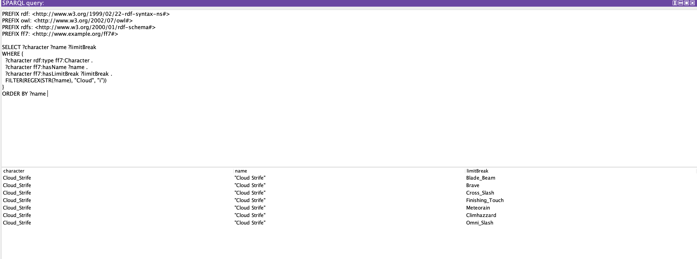
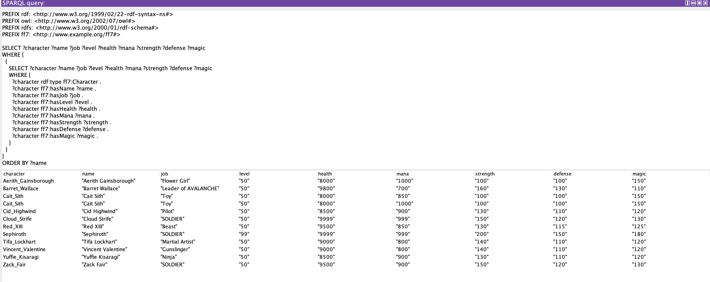
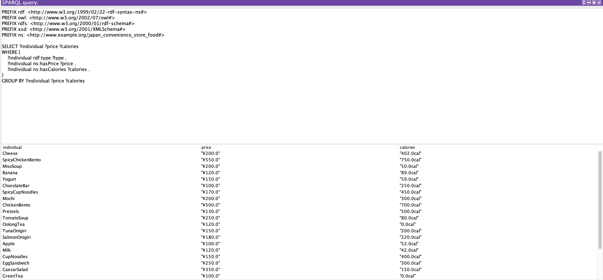

# AI 実習 2024 　課題レポート

## [第 10 回～第 12 回]

- **課題期間**︓ 2024/5/27,7/4,7/11(木)
- **課題提出期限**︓ 2024/7/18(木) 19:00

<!-- 要 記述 -->

| クラス | 学籍番号 |    氏 名     |
| :----: | :------: | :----------: |
|   A    | 20122077 | Roger Marvin |

## レポートの作成手順 (マークダウン記法)

- マークダウン記法[^1][^2][^3][^4]でレポートを作成する
- テキストエディタ＋機能拡張をインストール：
- VSCode https://code.visualstudio.com/download#
- 機能拡張(Markdown PDF, Markdown Preview Enhanced ) セットアップ
- ファイル名は、`AI実習2024A課題レポート(学籍番号)(学生氏名).md `
- 作成したら PDF ファイル、HTML ファイルを変換生成する

#### マークダウン記法についてわかりやすい説明、Web 情報

[マークダウン記法とは？](https://www.bing.com/videos/riverview/relatedvideo?q=%e3%83%9e%e3%83%bc%e3%82%af%e3%83%80%e3%82%a6%e3%83%b3%e8%a8%98%e6%b3%95&mid=4EE93F5EF42F9CAD0CCC4EE93F5EF42F9CAD0CCC&FORM=VIRE)
[Markdown 記法～基礎編～](https://qiita.com/miriwo/items/28d80f46c857de49f34b)
[マークダウン記法一覧](https://qiita.com/miriwo/items/28d80f46c857de49f34b)
[マークダウンの書き方](https://backlog.com/ja/blog/how-to-write-markdown/)

[^1]: (https://www.bing.com/videos/riverview/relatedvideo?q=%e3%83%9e%e3%83%bc%e3%82%af%e3%83%80%e3%82%a6%e3%83%b3%e8%a8%98%e6%b3%95&mid=4EE93F5EF42F9CAD0CCC4EE93F5EF42F9CAD0CCC&FORM=VIRE)マークダウン記法とは？
[^2]: (https://qiita.com/miriwo/items/28d80f46c857de49f34b) Markdown 記法～基礎編～
[^3]: (https://www.sejuku.net/blog/77398)マークダウン記法一覧
[^4]: (https://backlog.com/ja/blog/how-to-write-markdown/)マークダウンの書き方

### 外部ツール画面の図式引用

- 本様式をひな型とする
- 様式中に、マークダウンのコメントとして
  　　`<!-- 要 記述　回答 -->` と記されている箇所は忘れずに適切な記述を加筆する
- 図やスクリーンショットを引用する場合、フォルダにまとめておく
- 1 つのレポートにつき、1 つのフォルダを用意する
- そのフォルダに、md, pdf,html,および, 引用で使用した jpg,png 等ファイルをまとめて配置する
- $MR^3$で作成した RDF は、スクリーンショット画像として本文に取り込む
- $Protege$で作成したオントロジは、`OWL/XML Syntax` 形式で、`file名.owl`　として保存する
- $Protege$で作成した LOD は、`RDF/XML Syntax` 形式で、`file名.owl`　と保存する
- $Sparql$のソースコードは、マークダウン形式に、引用によって記述する

````
  　Sparqlのクエリコードを　```sql  と ```　で囲み、クエリの実行結果も　``` ``` で囲む
````

### レポート提出方法 Github のプライベートリポジトリにアップロード

- 2 学年 4 学期の**API 実習と同じ方法**
- Github のアカウントを作成し、**Practice-AI-2024** という名称でプライベートリポジトリを作成
- そのプライベートリポジトリに、指導員の Github アカウント= **keythrive**を招待する
- Github のプライベートリポジトリに次の名前で、6 つフォルダを用意する：
  - **report1-3**
  - **report4-6**
  - **report7-9**
  - **report10-12**
  - **report13-15**
  - **report-Final**
- Github のアカウント名、プライベートリポジトリ作成、6 つのフォルダをつくったか？招待を完了したか？について、FORMS アンケートするので必ず回答すること。
- FORMS アンケートはこちら：
  - https://forms.office.com/r/6iMLLYjw1t
- FORMS アンケートに未回答の場合、レポートを取得する方法が確立しないので、必ず回答のうえレポート提出可能な状態にすること

- それぞれの提出期限までに、必要なファイル一式を当該フォルダにアップロードしておく
- 〆切時刻を過ぎた時点で自動的に, 全員の Github プライベートリポジトリから、`git clone`などでファイルを一括ダウンロードする
- 提出が遅れるとダウンロードできず、未提出と判断される
- 真に止むを得ない事由で、提出期限が遅れる場合、事前にメールにて連絡・相談すること:
- mailto: **horikawa.keitaro@kaishi-pu.ac.jp**
- 事前連絡なしに、期限を過ぎた場合、その課題レポートは未提出として採点しない
- Github のアカウント登録、プライベートリポジトリ、ファイルアップロードが不明な場合は、必ず事前に確認・相談するか、すでに出来ている友達から教えてもらうこと

---

## 課題レポートのまとめ方

- 直近のグループ実習 3 回分をまとめて 1 つのレポートを作成する
- 毎回休まずに出席して、グループ討論に積極的に参画する
- グループを代表して発表し、質疑応答、議論、メモを確実にとる作業が大切
- 自グループと他グループの発表をしっかり聴いて、議論模様を簡潔にまとめて報告する
- それぞれの回の全てのグループ発表、および、
- 学生と教員からの質疑コメントを要約する
- ここまではグループメンバ間の協力作業で、差異化要素はほとんどないことが予想される
- 自作の成果（RDF,オントロジ等）には極力 "FOAF,SKOS,DC"など共通語彙を適用する
- **個人の努力を差異化要素**として、さらに踏み込んだ検討・実習の成果を 3 回分の**個人演習**について報告してよい
- 3 回で取り組んだ内容、理解を深めたことを独自レポートとして加筆可能
- 例えば、**作成した RDF,オントロジ,使用した LOD, 作成した Sparql クエリ,その他の AI 手法やプログラムとの連携技、それらの分析・考察・所感**　など

### 本実習・課題レポートに取り組む意義

- 半年後、本実習を「適当にやり過ごした学生群」と、「真剣に打ち込んで突き詰めた学生群」に明確に分かれることが予想される
- 前者と後者とで、成長の差は著しく広がり、臨地実務実習 II の実習成果および企業担当者から評価が如実に変わる
- 1 年後の今頃、就職活動の内々定数（場合によっては、転職ファストパスの数）が大きく変わることが見込まれる

---

### 第 10 回グループ課題の要約・整理

| 回数  | グループ名    | 発表者 | 発表内容 | 発表への質疑・コメント |
| :--: | :--------: |  :-- | :-- | :-- |
|  10   | **順風満帆** | 倉石大暉 | プログラミング言語について、TypeScriptがJavaScriptに変換されるように、C言語に変換される言語があるかを考えることができます。さらに、論理プログラミングを使えば、「AならばB、BならばC」という関係をもっと具体的に調べることができます。 | 発表の方は説明がわかりやすいです。また、プログラミング言語の概念でオンとロージーとSPARQLで表示して、面白かったです。質問されたものもちゃんと答えできて、わかりやすい説明しました。かなり興味深いの発表です。 |
|  10   | **臥薪嘗胆** | 阿部一成、小林相太、溝口将太 | このチームは3人が発表しました。まず、阿部さんがスターレイルに登場するキャラクター、タイプ、属性の関係について説明しました。主人公が持っている装備や属性を推測することができるだけでなく、キャラクターのスキルも詳しく解説しました。次に、相太くんがラーメンのスープについて話しました。現段階では事実を並べただけですが、トッピングやラーメンの種類を検索すると、その素材についても情報を提供できます。最後に、溝口くんがバレーボールのプレイヤーに関する情報を説明しました。二つのチームごとのポジションやスコアを入力しており、チームのメンバーやポジションごとの名前を入力すると検索できるようにしています。|3人ともそれぞれの専門分野について詳しく説明しており、非常に興味深い発表でした。阿部さんのスターレイルの解説はゲームファンにとって魅力的ですし、相太くんのラーメンのスープに関する情報は実用的です。溝口くんのバレーボールのプレイヤー情報もスポーツ愛好者にとって有益です。それぞれの発表が異なるテーマをカバーしており、全体としてバランスの取れた内容でした。|
|  10   | **不撓不屈** | 山崎、駒木根 | 山崎と通元は、12星座について発表しました。各星座の誕生日月の期間やラテン語での意味、構成されている星の定義について詳しく説明しました。一つの星座から複数の情報を得ることができ、それをもとに推理することができます。さらに、今後は他の星座についても情報を増やしていきたいと考えていると言います。 | 山崎さんと駒木根さんの発表は、12星座に関する情報を非常に詳しく説明していて興味深かったです。星座に関する多角的な情報を提供し、今後の拡充も期待できます。 |
|  10   | **雪中松柏** | ROGER MARVIN | 私は動物の情報に関するオンとロージーを作成しています。SPARQLでクラスや動物のリストを表示し、情報をまとめて関係性を記述することができます。 | RDFの主語と述語の関係性をすべて示すことができています。 |
|  10   | **積水成淵** | 加藤颯士、八幡真也 | このチームは二人が発表しました。まず、加藤くんはポケモンに関するオントロジーからタイプ相性の関係性を作成しました。技のタイプに応じて攻撃力などの変化を調査することができ、タイプが２つあるポケモンについても計算を行い、その結果を出力するようにしています。次に、八幡さんは銃についての論理プログラミングに取り組んでいます。異なる銃の種類に関する情報をまとめ、さらに操作系統などの詳細情報を追加していく予定です。 | 加藤くんのポケモンに関してのSPARQLオンとロージーで、ポケモンのタイプ相性に基づく戦略的な情報を提供して、ゲームプレイの深化に寄与してできます。一方で八幡さんの銃の論理プログラミングは、銃の技術や操作方法に関する理解を深めるできます。|
|  10   | **日進月歩** | 山口翔太 | 山口くんバーガーキングのトッピングについてのオントロージーSPARQL作っています。バーガーに含まれるバンズなどの関係性を推論するプログラムを開発しています。 | 山口翔太さんのオントロージーSPARQLは、食品業界におけるトッピングの関係性を理解するための興味深い取り組みです。一方で、自分の進むべき道についての内省が大切です。焦らずに自分の興味や目標を明確にすることが、迷いを解消する第一歩です。|

---

### 第 11 回グループ課題の要約・整理

| 回数   | グループ名    | 発表者 | 発表内容 | 発表への質疑・コメント |
| :--: | :--------: |  :-- | :-- | :-- |
|  11   | **順風満帆** | 倉石大暉 | 倉石大暉がSPARQLとオントロジーについて説明しています。オブジェクト言語が非言語であるものを表示させ、それをどの言語に変換できるかを検索する機能を提供しています。 | 倉石大暉の取り組みは、非言語のオブジェクト言語を理解し、それを他の言語に変換する可能性を探るという点で興味深いです。SPARQLとオントロジーを利用して、言語間の変換可能性を探求する姿勢は、情報の多様性と有用性を拡張する一助となると思います。 |
|  11   | **臥薪嘗胆** | 長橋弘幸、小林相太 | 長橋くんはSPARQLを利用して、アンデットアンラックに登場する「否定者」というキャラクターの情報を検索するシステムを開発中です。現在は一つの情報しか表示できない制約がありますが、これを改善してより多くの情報を提供できるように進めています。相太くんラーメンに関するオントロジーを構築し、各種ラーメンのトッピングや種類などの情報を検索できるシステムを開発しています。ただし、クラスとサブクラスの関係性がうまく繋がっておらず、ネットから取得したオントロジーの理解には課題があります。 | 長橋さんの取り組みは、特定のキャラクター情報を効率的に抽出することを目指しており、システムの改善に向けて進化しています。一方、相太くんのラーメンオントロジーはもっとちゃんとできたら、面白いし価値があるものなると思います。 |
|  11   | **不撓不屈** | 大竹啓之 | 大竹くんはSPARQLとオントロジーを利用して、星座に関する情報を管理しています。各星座の名称や星の名前、およびそれらをクラスとして詳細に記述しています。インスタンス内に星の名前などをすべて一括して記入してしまったため、それぞれを分類して検索できる仕組みを導入しました。具体的には、特定のクラスに属する星の名前を検索する機能を実装しています。 | 前回の発表の引き続きで、結構進化しました。また、発表は分かりやすかったです。 |
|  11   | **雪中松柏** | ROGER MARVIN | 私はSPARQLとオントロジーを用いて、コンビニに関する情報を管理しています。各商品の価格やカロリーなどのデータを詳細に記述し、価格やカロリーを一覧として表示する機能を実装しています。また、FF7のキャラクターごとに持っている技を詳細に記述したオントロジーを構築しています。各キャラクターがどんな技を持っているかを明確に表示できるようにしています。 | SPARQLの使用できて、作ったオンとロージーをSPARQLのクエリでデータを表示できました。コンビニとFF7の両方のオンとロージーをSPARQLでちゃんと表示できました。|
|  11   | **積水成淵** | 加藤颯士、竹田勇斗 | 加藤くんがSPARQLとオントロジーに関連して、ポケモンの進化前と進化後を一覧で表示し、図鑑No.に基づいてポケモンの一覧を表示する機能を開発しています。ただし、Classの表示方法について課題が残っています。竹田くんはアーマードコアに関するオントロジーを構築しています。キャラクターのセリフをコメントから検索し、どのキャラクターがどのようなセリフを言ったかを確認できる機能を提供しています。また、オブジェクトを変更することでキャラクター同士の関係性を検索することも可能です。 | 加藤くんの発表ははわかりやすいでポケモンに関しての理解度が結構上がりました。また、竹田くんのSPARQLに関しての発表は分かりますが、アーマードコアに詳しいくないので、ちょっと理解しづらいことろがあります。しかし、二人ともの発表はよかったです。 |
|  11   | **日進月歩** | 池田侑哉 | 池田くんはSPARQLを用いて、楽器に関する情報を管理しています。楽器をクラスとし、各メーカーを記述しています。さらに、ギターの種類などをサブクラスとして詳細に記述しています。クラスのエンドポイントを一覧として検索し、表示することができました。また、クラスの主語述語の関係をクエリで検索する機能も実装しています。 | わかりやすい発表で、楽器に関して理解が深くなれます。 |

---


### 第 12 回グループ課題の要約・整理

| 回数  | グループ名    | 発表者 | 発表内容 | 発表への質疑・コメント |
| :--: | :--------: |  :-- | :-- | :-- |
|  12   | **順風満帆** | 平栗颯萌、倉石大暉 | 平栗くんスプラトゥーンに関するオントロジーで、シューターのダメージが30以上かつメガトンレーザーが使用可能な武器を検索しています。これにより、戦略的なゲームプレイの支援を目指しています。一方、倉石くんはSPARQLのエンドポイントをエディターで表示し、ローカルホストでサーバーを立ち上げてリクエストに応答するシステムを構築しています。これにより、効率的なデータの管理と処理が可能となります。 | 前回の引き続きで結構分かりやすいで、しかし前回より難しいで、結構わかりにくいですね。もちろん、よく見たら分かりますが、やはり倉石くんのレベルは高いです。すごいです。 |
|  12   | **臥薪嘗胆** | 阿部一成、長橋弘幸 | 阿部くんはジャパンサーチを使用して検索を行いましたが、"織田信長"と入力すると作者ではなく関連する作品が表示されました。Pythonでも同様に関連した作品が表示されていることが確認されました。一方、長橋くんはアンデットアンラックのオントロジーで、前回表示できなかった"否定者"という能力を持ったキャラクターを検索できるように改善しました。しかし、組織との関係性の表示には課題があるそうです。 | 阿部一成さんは、検索結果が意図したものと異なっており、絞り込むクエリの改善が必要です。一方、長橋弘幸さんは、オントロジーの検索精度向上に取り組んでいますが、組織との関係性の表示についてはさらなる改善が求められています。 |
|  12   | **不撓不屈** | 大竹啓之 | 大竹くんは星座のオントロジーにおいて、星座の名前を検索すると「星の名前」と「明るさ」を同時に検索できるように改善しました。これにより、以前は星座の検索で星の名前しか表示されなかった問題を解決し、星の名前からでも星座を効率的に検索できるようになりました。 | 前回の引き続きで、結構レベルアップしました。しかし、今回の説明は結構分かりにくいです。 |
|  12   | **雪中松柏** | 臼田誠 | 誠くんが前回チームで作ったコンビニオンとロージーと作ったSPARQLクエリでサブクエリを発表しました。また、今回講義で紹介してもらったVirtuosoでSPARQLを起動して、発表で報告しました。| 第10回の発表から引き続いて発表内容はわかりやすいし、オンとロージー自体は簡単なもので、見たらすぐにわかるものです。発表の説明も分かりやすいで、実際Virtuosoでクエリを実行できました。 |
|  12   | **積水成淵** | 加藤颯士、八幡真也 | 加藤くんは三段階進化するポケモンを検索するためのシステムを開発しています。進化前と進化後のオブジェクトを両方持つポケモンから、三段階進化を見つけ出すことが可能です。八幡さんは作者の別名義を表示させるためのクエリを構築しています。また、配偶者が死別した場合の俳優を特定するために、"死別"という言葉を含む情報を検索しています。 | 前回の引き続きで結構分かりやすいで、前回より面白かったです。 |
|  12   | **日進月歩** | 山崎秀晃 | 山崎くんは諸説とその著者を検索するクエリを開発しています。現在、このサービスはウィキペディアで運用されており、アニメ作品に関する情報の検索に課題があります。 | 使ったオンとロージーは普通ですが、オンとロージーとSPARQLのサブクエリの説明は結構分かりやういです。 |

---

### [自己成長、成果、上位成績に向けて]　個人成果の報告　

第10回から第12回までの講義は今まで作ったオンとロージーをSPARQLクエリで実行したら、オンとロージーの情報やデータをゲットできると分かりました。自分のチームは今回一緒に取り組んで、復習なオンとロージーを作りました。自分が頑張ったものは二つあります。まず、結構前の時でFF7のXMLをオンとロージー化し変化して、SPARQLを実行しました。コートと結果は以下の通りです。

## Final Fantasy 7 オンとロージー
```owl
<!DOCTYPE rdf:RDF [
    <!ENTITY xsd "entity-value">
]>
<rdf:RDF xmlns="http://www.example.org/ff7#"
    xml:base="http://www.example.org/ff7"
    xmlns:rdf="http://www.w3.org/1999/02/22-rdf-syntax-ns#"
    xmlns:owl="http://www.w3.org/2002/07/owl#"
    xmlns:xsd="http://www.w3.org/2001/XMLSchema#"
    xmlns:rdfs="http://www.w3.org/2000/01/rdf-schema#">
    <owl:Ontology rdf:about="http://www.example.org/ff7" />

    <!-- Classes -->
    <owl:Class rdf:about="#Character" />
    <owl:Class rdf:about="#LimitBreak" />

    <!-- Properties -->
    <owl:DatatypeProperty rdf:about="#hasName">
        <rdfs:domain rdf:resource="#Character" />
        <rdfs:range />
    </owl:DatatypeProperty>
    <owl:DatatypeProperty rdf:about="#hasJob">
        <rdfs:domain rdf:resource="#Character" />
        <rdfs:range />
    </owl:DatatypeProperty>
    <owl:DatatypeProperty rdf:about="#hasLevel">
        <rdfs:domain rdf:resource="#Character" />
        <rdfs:range />
    </owl:DatatypeProperty>
    <owl:DatatypeProperty rdf:about="#hasHealth">
        <rdfs:domain rdf:resource="#Character" />
        <rdfs:range />
    </owl:DatatypeProperty>
    <owl:DatatypeProperty rdf:about="#hasMana">
        <rdfs:domain rdf:resource="#Character" />
        <rdfs:range />
    </owl:DatatypeProperty>
    <owl:DatatypeProperty rdf:about="#hasStrength">
        <rdfs:domain rdf:resource="#Character" />
        <rdfs:range />
    </owl:DatatypeProperty>
    <owl:DatatypeProperty rdf:about="#hasDefense">
        <rdfs:domain rdf:resource="#Character" />
        <rdfs:range />
    </owl:DatatypeProperty>
    <owl:DatatypeProperty rdf:about="#hasMagic">
        <rdfs:domain rdf:resource="#Character" />
        <rdfs:range />
    </owl:DatatypeProperty>
    <owl:ObjectProperty rdf:about="#hasLimitBreak">
        <rdfs:domain rdf:resource="#Character" />
        <rdfs:range />
    </owl:ObjectProperty>

    <!-- Individuals -->
    <owl:NamedIndividual rdf:about="#Cloud_Strife">
        <rdf:type rdf:resource="#Character" />
        <hasName>Cloud Strife</hasName>
        <hasJob>SOLDIER</hasJob>
        <hasLevel>50</hasLevel>
        <hasHealth>9999</hasHealth>
        <hasMana>999</hasMana>
        <hasStrength>150</hasStrength>
        <hasDefense>120</hasDefense>
        <hasMagic>130</hasMagic>
        <hasLimitBreak rdf:resource="#Omni_Slash" />
        <hasLimitBreak rdf:resource="#Climhazzard" />
        <hasLimitBreak rdf:resource="#Brave" />
        <hasLimitBreak rdf:resource="#Cross_Slash" />
        <hasLimitBreak rdf:resource="#Blade_Beam" />
        <hasLimitBreak rdf:resource="#Meteorain" />
        <hasLimitBreak rdf:resource="#Finishing_Touch" />
    </owl:NamedIndividual>

    <owl:NamedIndividual rdf:about="#Tifa_Lockhart">
        <rdf:type rdf:resource="#Character" />
        <hasName>Tifa Lockhart</hasName>
        <hasJob>Martial Artist</hasJob>
        <hasLevel>50</hasLevel>
        <hasHealth>9000</hasHealth>
        <hasMana>800</hasMana>
        <hasStrength>140</hasStrength>
        <hasDefense>110</hasDefense>
        <hasMagic>120</hasMagic>
        <hasLimitBreak rdf:resource="#Final_Heaven" />
        <hasLimitBreak rdf:resource="#Beat_Rush" />
        <hasLimitBreak rdf:resource="#Somersault" />
        <hasLimitBreak rdf:resource="#Waterkick" />
        <hasLimitBreak rdf:resource="#Meteodrive" />
        <hasLimitBreak rdf:resource="#Dolphin_Blow" />
        <hasLimitBreak rdf:resource="#Meteor_Strike" />
    </owl:NamedIndividual>

    <owl:NamedIndividual rdf:about="#Red_XIII">
        <rdf:type rdf:resource="#Character" />
        <hasName>Red XIII</hasName>
        <hasJob>Beast</hasJob>
        <hasLevel>50</hasLevel>
        <hasHealth>9500</hasHealth>
        <hasMana>850</hasMana>
        <hasStrength>130</hasStrength>
        <hasDefense>115</hasDefense>
        <hasMagic>125</hasMagic>
        <hasLimitBreak rdf:resource="#Cosmo_Memory" />
        <hasLimitBreak rdf:resource="#Sled_Fang" />
        <hasLimitBreak rdf:resource="#Lunatic_High" />
        <hasLimitBreak rdf:resource="#Blood_Fang" />
        <hasLimitBreak rdf:resource="#Stardust_Ray" />
        <hasLimitBreak rdf:resource="#Howling_Moon" />
        <hasLimitBreak rdf:resource="#Earth_Rave" />
    </owl:NamedIndividual>

    <owl:NamedIndividual rdf:about="#Aerith_Gainsborough">
        <rdf:type rdf:resource="#Character" />
        <hasName>Aerith Gainsborough</hasName>
        <hasJob>Flower Girl</hasJob>
        <hasLevel>50</hasLevel>
        <hasHealth>8000</hasHealth>
        <hasMana>1000</hasMana>
        <hasStrength>100</hasStrength>
        <hasDefense>100</hasDefense>
        <hasMagic>150</hasMagic>
        <hasLimitBreak rdf:resource="#Great_Gospel" />
        <hasLimitBreak rdf:resource="#Healing_Wind" />
        <hasLimitBreak rdf:resource="#Seal_Evil" />
        <hasLimitBreak rdf:resource="#Breath_of_the_Earth" />
        <hasLimitBreak rdf:resource="#Fury_Brand" />
        <hasLimitBreak rdf:resource="#Planet_Protector" />
        <hasLimitBreak rdf:resource="#Pulse_of_Life" />
    </owl:NamedIndividual>

    <owl:NamedIndividual rdf:about="#Barret_Wallace">
        <rdf:type rdf:resource="#Character" />
        <hasName>Barret Wallace</hasName>
        <hasJob>Leader of AVALANCHE</hasJob>
        <hasLevel>50</hasLevel>
        <hasHealth>9800</hasHealth>
        <hasMana>700</hasMana>
        <hasStrength>160</hasStrength>
        <hasDefense>130</hasDefense>
        <hasMagic>110</hasMagic>
        <hasLimitBreak rdf:resource="#Catastrophe" />
        <hasLimitBreak rdf:resource="#Big_Shot" />
        <hasLimitBreak rdf:resource="#Mindblow" />
        <hasLimitBreak rdf:resource="#Grenade_Bomb" />
        <hasLimitBreak rdf:resource="#Hammerblow" />
        <hasLimitBreak rdf:resource="#Satellite_Beam" />
        <hasLimitBreak rdf:resource="#Ungarmax" />
    </owl:NamedIndividual>

    <owl:NamedIndividual rdf:about="#Zack_Fair">
        <rdf:type rdf:resource="#Character" />
        <hasName>Zack Fair</hasName>
        <hasJob>SOLDIER</hasJob>
        <hasLevel>50</hasLevel>
        <hasHealth>9500</hasHealth>
        <hasMana>900</hasMana>
        <hasStrength>150</hasStrength>
        <hasDefense>120</hasDefense>
        <hasMagic>130</hasMagic>
        <hasLimitBreak rdf:resource="#Rush_Assault" />
        <hasLimitBreak rdf:resource="#Chain_Slash" />
        <hasLimitBreak rdf:resource="#Meteor_Shower" />
        <hasLimitBreak rdf:resource="#Octaslash" />
    </owl:NamedIndividual>

    <owl:NamedIndividual rdf:about="#Sephiroth">
        <rdf:type rdf:resource="#Character" />
        <hasName>Sephiroth</hasName>
        <hasJob>SOLDIER</hasJob>
        <hasLevel>99</hasLevel>
        <hasHealth>9999</hasHealth>
        <hasMana>999</hasMana>
        <hasStrength>200</hasStrength>
        <hasDefense>150</hasDefense>
        <hasMagic>180</hasMagic>
        <hasLimitBreak rdf:resource="#Supernova" />
        <hasLimitBreak rdf:resource="#Hell's_Gate" />
        <hasLimitBreak rdf:resource="#Shadow_Flare" />
    </owl:NamedIndividual>

    <owl:NamedIndividual rdf:about="#Yuffie_Kisaragi">
        <rdf:type rdf:resource="#Character" />
        <hasName>Yuffie Kisaragi</hasName>
        <hasJob>Ninja</hasJob>
        <hasLevel>50</hasLevel>
        <hasHealth>8500</hasHealth>
        <hasMana>900</hasMana>
        <hasStrength>130</hasStrength>
        <hasDefense>110</hasDefense>
        <hasMagic>120</hasMagic>
        <hasLimitBreak rdf:resource="#All_Creation" />
        <hasLimitBreak rdf:resource="#Greased_Lightning" />
        <hasLimitBreak rdf:resource="#Clear_Tranquil" />
        <hasLimitBreak rdf:resource="#Landscaper" />
        <hasLimitBreak rdf:resource="#Bloodfest" />
        <hasLimitBreak rdf:resource="#Gauntlet" />
        <hasLimitBreak rdf:resource="#Doom_of_the_Living" />
    </owl:NamedIndividual>

    <owl:NamedIndividual rdf:about="#Cait_Sith">
        <rdf:type rdf:resource="#Character" />
        <hasName>Cait Sith</hasName>
        <hasJob>Toy</hasJob>
        <hasLevel>50</hasLevel>
        <hasHealth>8000</hasHealth>
        <hasMana>850</hasMana>
        <hasMana>1000</hasMana>
        <hasStrength>100</hasStrength>
        <hasDefense>100</hasDefense>
        <hasMagic>150</hasMagic>
        <hasLimitBreak rdf:resource="#Mog_Riot" />
        <hasLimitBreak rdf:resource="#Dice" />
        <hasLimitBreak rdf:resource="#Slots" />
    </owl:NamedIndividual>

    <owl:NamedIndividual rdf:about="#Vincent_Valentine">
        <rdf:type rdf:resource="#Character" />
        <hasName>Vincent Valentine</hasName>
        <hasJob>Gunslinger</hasJob>
        <hasLevel>50</hasLevel>
        <hasHealth>9000</hasHealth>
        <hasMana>800</hasMana>
        <hasStrength>140</hasStrength>
        <hasDefense>110</hasDefense>
        <hasMagic>120</hasMagic>
        <hasLimitBreak rdf:resource="#Galian_Beast" />
        <hasLimitBreak rdf:resource="#Death_Gigas" />
        <hasLimitBreak rdf:resource="#Hellmasker" />
        <hasLimitBreak rdf:resource="#Chaos" />
    </owl:NamedIndividual>

    <owl:NamedIndividual rdf:about="#Cid_Highwind">
        <rdf:type rdf:resource="#Character" />
        <hasName>Cid Highwind</hasName>
        <hasJob>Pilot</hasJob>
        <hasLevel>50</hasLevel>
        <hasHealth>8500</hasHealth>
        <hasMana>900</hasMana>
        <hasStrength>130</hasStrength>
        <hasDefense>110</hasDefense>
        <hasMagic>120</hasMagic>
        <hasLimitBreak rdf:resource="#Highwind" />
        <hasLimitBreak rdf:resource="#Boost_Jump" />
        <hasLimitBreak rdf:resource="#Dynamite" />
        <hasLimitBreak rdf:resource="#Hyper_Jump" />
        <hasLimitBreak rdf:resource="#Dragon" />
        <hasLimitBreak rdf:resource="#Dragon_Dive" />
        <hasLimitBreak rdf:resource="#Big_Brawl" />
    </owl:NamedIndividual>

    <owl:NamedIndividual rdf:about="#Omni_Slash">
        <rdf:type rdf:resource="#LimitBreak" />
    </owl:NamedIndividual>
    <owl:NamedIndividual rdf:about="#Climhazzard">
        <rdf:type rdf:resource="#LimitBreak" />
    </owl:NamedIndividual>
    <owl:NamedIndividual rdf:about="#Brave">
        <rdf:type rdf:resource="#LimitBreak" />
    </owl:NamedIndividual>
    <owl:NamedIndividual rdf:about="#Cross_Slash">
        <rdf:type rdf:resource="#LimitBreak" />
    </owl:NamedIndividual>
    <owl:NamedIndividual rdf:about="#Blade_Beam">
        <rdf:type rdf:resource="#LimitBreak" />
    </owl:NamedIndividual>
    <owl:NamedIndividual rdf:about="#Meteorain">
        <rdf:type rdf:resource="#LimitBreak" />
    </owl:NamedIndividual>
    <owl:NamedIndividual rdf:about="#Finishing_Touch">
        <rdf:type rdf:resource="#LimitBreak" />
    </owl:NamedIndividual>
    <owl:NamedIndividual rdf:about="#Final_Heaven">
        <rdf:type rdf:resource="#LimitBreak" />
    </owl:NamedIndividual>
    <owl:NamedIndividual rdf:about="#Cosmo_Memory">
        <rdf:type rdf:resource="#LimitBreak" />
    </owl:NamedIndividual>
    <owl:NamedIndividual rdf:about="#Great_Gospel">
        <rdf:type rdf:resource="#LimitBreak" />
    </owl:NamedIndividual>
    <owl:NamedIndividual rdf:about="#Catastrophe">
        <rdf:type rdf:resource="#LimitBreak" />
    </owl:NamedIndividual>
    <owl:NamedIndividual rdf:about="#Rush_Assault">
        <rdf:type rdf:resource="#LimitBreak" />
    </owl:NamedIndividual>
    <owl:NamedIndividual rdf:about="#Supernova">
        <rdf:type rdf:resource="#LimitBreak" />
    </owl:NamedIndividual>
    <owl:NamedIndividual rdf:about="#All_Creation">
        <rdf:type rdf:resource="#LimitBreak" />
    </owl:NamedIndividual>
    <owl:NamedIndividual rdf:about="#Mog_Riot">
        <rdf:type rdf:resource="#LimitBreak" />
    </owl:NamedIndividual>
    <owl:NamedIndividual rdf:about="#Galian_Beast">
        <rdf:type rdf:resource="#LimitBreak" />
    </owl:NamedIndividual>
    <owl:NamedIndividual rdf:about="#Highwind">
        <rdf:type rdf:resource="#LimitBreak" />
    </owl:NamedIndividual>
    <owl:NamedIndividual rdf:about="#Beat_Rush">
        <rdf:type rdf:resource="#LimitBreak" />
    </owl:NamedIndividual>
    <owl:NamedIndividual rdf:about="#Somersault">
        <rdf:type rdf:resource="#LimitBreak" />
    </owl:NamedIndividual>
    <owl:NamedIndividual rdf:about="#Waterkick">
        <rdf:type rdf:resource="#LimitBreak" />
    </owl:NamedIndividual>
    <owl:NamedIndividual rdf:about="#Meteodrive">
        <rdf:type rdf:resource="#LimitBreak" />
    </owl:NamedIndividual>
    <owl:NamedIndividual rdf:about="#Dolphin_Blow">
        <rdf:type rdf:resource="#LimitBreak" />
    </owl:NamedIndividual>
    <owl:NamedIndividual rdf:about="#Meteor_Strike">
        <rdf:type rdf:resource="#LimitBreak" />
    </owl:NamedIndividual>
    <owl:NamedIndividual rdf:about="#Sled_Fang">
        <rdf:type rdf:resource="#LimitBreak" />
    </owl:NamedIndividual>
    <owl:NamedIndividual rdf:about="#Lunatic_High">
        <rdf:type rdf:resource="#LimitBreak" />
    </owl:NamedIndividual>
    <owl:NamedIndividual rdf:about="#Blood_Fang">
        <rdf:type rdf:resource="#LimitBreak" />
    </owl:NamedIndividual>
    <owl:NamedIndividual rdf:about="#Stardust_Ray">
        <rdf:type rdf:resource="#LimitBreak" />
    </owl:NamedIndividual>
    <owl:NamedIndividual rdf:about="#Howling_Moon">
        <rdf:type rdf:resource="#LimitBreak" />
    </owl:NamedIndividual>
    <owl:NamedIndividual rdf:about="#Earth_Rave">
        <rdf:type rdf:resource="#LimitBreak" />
    </owl:NamedIndividual>
    <owl:NamedIndividual rdf:about="#Healing_Wind">
        <rdf:type rdf:resource="#LimitBreak" />
    </owl:NamedIndividual>
    <owl:NamedIndividual rdf:about="#Seal_Evil">
        <rdf:type rdf:resource="#LimitBreak" />
    </owl:NamedIndividual>
    <owl:NamedIndividual rdf:about="#Breath_of_the_Earth">
        <rdf:type rdf:resource="#LimitBreak" />
    </owl:NamedIndividual>
    <owl:NamedIndividual rdf:about="#Fury_Brand">
        <rdf:type rdf:resource="#LimitBreak" />
    </owl:NamedIndividual>
    <owl:NamedIndividual rdf:about="#Planet_Protector">
        <rdf:type rdf:resource="#LimitBreak" />
    </owl:NamedIndividual>
    <owl:NamedIndividual rdf:about="#Pulse_of_Life">
        <rdf:type rdf:resource="#LimitBreak" />
    </owl:NamedIndividual>
    <owl:NamedIndividual rdf:about="#Big_Shot">
        <rdf:type rdf:resource="#LimitBreak" />
    </owl:NamedIndividual>
    <owl:NamedIndividual rdf:about="#Mindblow">
        <rdf:type rdf:resource="#LimitBreak" />
    </owl:NamedIndividual>
    <owl:NamedIndividual rdf:about="#Grenade_Bomb">
        <rdf:type rdf:resource="#LimitBreak" />
    </owl:NamedIndividual>
    <owl:NamedIndividual rdf:about="#Hammerblow">
        <rdf:type rdf:resource="#LimitBreak" />
    </owl:NamedIndividual>
    <owl:NamedIndividual rdf:about="#Satellite_Beam">
        <rdf:type rdf:resource="#LimitBreak" />
    </owl:NamedIndividual>
    <owl:NamedIndividual rdf:about="#Ungarmax">
        <rdf:type rdf:resource="#LimitBreak" />
    </owl:NamedIndividual>
    <owl:NamedIndividual rdf:about="#Chain_Slash">
        <rdf:type rdf:resource="#LimitBreak" />
    </owl:NamedIndividual>
    <owl:NamedIndividual rdf:about="#Meteor_Shower">
        <rdf:type rdf:resource="#LimitBreak" />
    </owl:NamedIndividual>
    <owl:NamedIndividual rdf:about="#Octaslash">
        <rdf:type rdf:resource="#LimitBreak" />
    </owl:NamedIndividual>
    <owl:NamedIndividual rdf:about="#Hell's_Gate">
        <rdf:type rdf:resource="#LimitBreak" />
    </owl:NamedIndividual>
    <owl:NamedIndividual rdf:about="#Shadow_Flare">
        <rdf:type rdf:resource="#LimitBreak" />
    </owl:NamedIndividual>
    <owl:NamedIndividual rdf:about="#Greased_Lightning">
        <rdf:type rdf:resource="#LimitBreak" />
    </owl:NamedIndividual>
    <owl:NamedIndividual rdf:about="#Clear_Tranquil">
        <rdf:type rdf:resource="#LimitBreak" />
    </owl:NamedIndividual>
    <owl:NamedIndividual rdf:about="#Landscaper">
        <rdf:type rdf:resource="#LimitBreak" />
    </owl:NamedIndividual>
    <owl:NamedIndividual rdf:about="#Bloodfest">
        <rdf:type rdf:resource="#LimitBreak" />
    </owl:NamedIndividual>
    <owl:NamedIndividual rdf:about="#Gauntlet">
        <rdf:type rdf:resource="#LimitBreak" />
    </owl:NamedIndividual>
    <owl:NamedIndividual rdf:about="#Doom_of_the_Living">
        <rdf:type rdf:resource="#LimitBreak" />
    </owl:NamedIndividual>
    <owl:NamedIndividual rdf:about="#Dice">
        <rdf:type rdf:resource="#LimitBreak" />
    </owl:NamedIndividual>
    <owl:NamedIndividual rdf:about="#Slots">
        <rdf:type rdf:resource="#LimitBreak" />
    </owl:NamedIndividual>
    <owl:NamedIndividual rdf:about="#Death_Gigas">
        <rdf:type rdf:resource="#LimitBreak" />
    </owl:NamedIndividual>
    <owl:NamedIndividual rdf:about="#Hellmasker">
        <rdf:type rdf:resource="#LimitBreak" />
    </owl:NamedIndividual>
    <owl:NamedIndividual rdf:about="#Chaos">
        <rdf:type rdf:resource="#LimitBreak" />
    </owl:NamedIndividual>
    <owl:NamedIndividual rdf:about="#Boost_Jump">
        <rdf:type rdf:resource="#LimitBreak" />
    </owl:NamedIndividual>
    <owl:NamedIndividual rdf:about="#Dynamite">
        <rdf:type rdf:resource="#LimitBreak" />
    </owl:NamedIndividual>
    <owl:NamedIndividual rdf:about="#Hyper_Jump">
        <rdf:type rdf:resource="#LimitBreak" />
    </owl:NamedIndividual>
    <owl:NamedIndividual rdf:about="#Dragon">
        <rdf:type rdf:resource="#LimitBreak" />
    </owl:NamedIndividual>
    <owl:NamedIndividual rdf:about="#Dragon_Dive">
        <rdf:type rdf:resource="#LimitBreak" />
    </owl:NamedIndividual>
    <owl:NamedIndividual rdf:about="#Big_Brawl">
        <rdf:type rdf:resource="#LimitBreak" />
    </owl:NamedIndividual>

</rdf:RDF>
```
### SPARQL QUERY
```sparql
PREFIX rdf: <http://www.w3.org/1999/02/22-rdf-syntax-ns#>
PREFIX owl: <http://www.w3.org/2002/07/owl#>
PREFIX rdfs: <http://www.w3.org/2000/01/rdf-schema#>
PREFIX ff7: <http://www.example.org/ff7#>

SELECT ?character ?name ?limitBreak
WHERE {
  ?character rdf:type ff7:Character .
  ?character ff7:hasName ?name .
  ?character ff7:hasLimitBreak ?limitBreak .
  FILTER(REGEX(STR(?name), "Cloud", "i"))
}
ORDER BY ?name 

```
> FILTER(REGEX(STR(?name), "Cloud", "i"))は検索する時に使ったフィルターです。例えば「CLoud」や「cLoUd」をクエリに入力しても、「Cloud Strife」というキャラのデータがゲットできるフィルターです。


### SUB-QUERY
```sparql
PREFIX rdf: <http://www.w3.org/1999/02/22-rdf-syntax-ns#>
PREFIX owl: <http://www.w3.org/2002/07/owl#>
PREFIX rdfs: <http://www.w3.org/2000/01/rdf-schema#>
PREFIX ff7: <http://www.example.org/ff7#>
SELECT ?character ?name ?limitBreak
WHERE {
  {
    SELECT ?character ?name
    WHERE {
      ?character rdf:type ff7:Character .
      ?character ff7:hasName ?name .
      FILTER(REGEX(STR(?name), "Cloud", "i"))
    }
  }
  ?character ff7:hasLimitBreak ?limitBreak .
}
ORDER BY ?name 
```


```sparql
PREFIX rdf: <http://www.w3.org/1999/02/22-rdf-syntax-ns#>
PREFIX owl: <http://www.w3.org/2002/07/owl#>
PREFIX rdfs: <http://www.w3.org/2000/01/rdf-schema#>
PREFIX ff7: <http://www.example.org/ff7#>

SELECT ?character ?name ?job ?level ?health ?mana ?strength ?defense ?magic
WHERE {
  {
    SELECT ?character ?name ?job ?level ?health ?mana ?strength ?defense ?magic
    WHERE {
      ?character rdf:type ff7:Character .
      ?character ff7:hasName ?name .
      ?character ff7:hasJob ?job .
      ?character ff7:hasLevel ?level .
      ?character ff7:hasHealth ?health .
      ?character ff7:hasMana ?mana .
      ?character ff7:hasStrength ?strength .
      ?character ff7:hasDefense ?defense .
      ?character ff7:hasMagic ?magic .
    }
  }
}
ORDER BY ?name
```



## コンビニ オンとロージー
```owl
<!DOCTYPE rdf:RDF [
    <!ENTITY xsd "http://www.w3.org/2001/XMLSchema#">
]><!-- File: japan_convenience_store_food.owl -->
<rdf:RDF xmlns="http://www.example.org/japan_convenience_store_food#"
    xml:base="http://www.example.org/japan_convenience_store_food"
    xmlns:rdf="http://www.w3.org/1999/02/22-rdf-syntax-ns#"
    xmlns:owl="http://www.w3.org/2002/07/owl#"
    xmlns:rdfs="http://www.w3.org/2000/01/rdf-schema#"
    xmlns:xsd="http://www.w3.org/2001/XMLSchema#">
    <owl:Ontology rdf:about="http://www.example.org/japan_convenience_store_food" />

    <!-- Classes -->
    <owl:Class rdf:about="#Food" />
    <owl:Class rdf:about="#Bento">
        <rdfs:subClassOf rdf:resource="#Food" />
    </owl:Class>
    <owl:Class rdf:about="#Onigiri">
        <rdfs:subClassOf rdf:resource="#Food" />
    </owl:Class>
    <owl:Class rdf:about="#Sandwich">
        <rdfs:subClassOf rdf:resource="#Food" />
    </owl:Class>
    <owl:Class rdf:about="#Drink">
        <rdfs:subClassOf rdf:resource="#Food" />
    </owl:Class>
    <owl:Class rdf:about="#Snack">
        <rdfs:subClassOf rdf:resource="#Food" />
    </owl:Class>
    <owl:Class rdf:about="#Dessert">
        <rdfs:subClassOf rdf:resource="#Food" />
    </owl:Class>
    <owl:Class rdf:about="#InstantNoodle">
        <rdfs:subClassOf rdf:resource="#Food" />
    </owl:Class>
    <owl:Class rdf:about="#Salad">
        <rdfs:subClassOf rdf:resource="#Food" />
    </owl:Class>
    <owl:Class rdf:about="#Soup">
        <rdfs:subClassOf rdf:resource="#Food" />
    </owl:Class>
    <owl:Class rdf:about="#Fruit">
        <rdfs:subClassOf rdf:resource="#Food" />
    </owl:Class>
    <owl:Class rdf:about="#Bakery">
        <rdfs:subClassOf rdf:resource="#Food" />
    </owl:Class>
    <owl:Class rdf:about="#Dairy">
        <rdfs:subClassOf rdf:resource="#Food" />
    </owl:Class>

    <!-- Properties -->
    <owl:DatatypeProperty rdf:about="#hasPrice">
        <rdfs:domain rdf:resource="#Food" />
        <rdfs:range rdf:resource="&xsd;float" />
    </owl:DatatypeProperty>
    <owl:DatatypeProperty rdf:about="#hasCalories">
        <rdfs:domain rdf:resource="#Food" />
        <rdfs:range rdf:resource="&xsd;float" />
    </owl:DatatypeProperty>

    <!-- Individuals -->
    <owl:NamedIndividual rdf:about="#ChickenBento">
        <rdf:type rdf:resource="#Bento" />
        <hasPrice>¥500.0</hasPrice>
        <hasCalories>700.0cal</hasCalories>
    </owl:NamedIndividual>
    <owl:NamedIndividual rdf:about="#TunaOnigiri">
        <rdf:type rdf:resource="#Onigiri" />
        <hasPrice>¥150.0</hasPrice>
        <hasCalories>200.0cal</hasCalories>
    </owl:NamedIndividual>
    <owl:NamedIndividual rdf:about="#EggSandwich">
        <rdf:type rdf:resource="#Sandwich" />
        <hasPrice>¥250.0</hasPrice>
        <hasCalories>300.0cal</hasCalories>
    </owl:NamedIndividual>
    <owl:NamedIndividual rdf:about="#GreenTea">
        <rdf:type rdf:resource="#Drink" />
        <hasPrice>¥100.0</hasPrice>
        <hasCalories>0.0cal</hasCalories>
    </owl:NamedIndividual>
    <owl:NamedIndividual rdf:about="#PotatoChips">
        <rdf:type rdf:resource="#Snack" />
        <hasPrice>¥120.0</hasPrice>
        <hasCalories>550.0cal</hasCalories>
    </owl:NamedIndividual>
    <owl:NamedIndividual rdf:about="#ChocolateBar">
        <rdf:type rdf:resource="#Snack" />
        <hasPrice>¥100.0</hasPrice>
        <hasCalories>250.0cal</hasCalories>
    </owl:NamedIndividual>
    <owl:NamedIndividual rdf:about="#Mochi">
        <rdf:type rdf:resource="#Dessert" />
        <hasPrice>¥200.0</hasPrice>
        <hasCalories>300.0cal</hasCalories>
    </owl:NamedIndividual>
    <owl:NamedIndividual rdf:about="#CupNoodles">
        <rdf:type rdf:resource="#InstantNoodle" />
        <hasPrice>¥150.0</hasPrice>
        <hasCalories>400.0cal</hasCalories>
    </owl:NamedIndividual>
    <owl:NamedIndividual rdf:about="#CaesarSalad">
        <rdf:type rdf:resource="#Salad" />
        <hasPrice>¥350.0</hasPrice>
        <hasCalories>150.0cal</hasCalories>
    </owl:NamedIndividual>
    <owl:NamedIndividual rdf:about="#FruitSalad">
        <rdf:type rdf:resource="#Salad" />
        <hasPrice>¥300.0</hasPrice>
        <hasCalories>120.0cal</hasCalories>
    </owl:NamedIndividual>
    <owl:NamedIndividual rdf:about="#SpicyChickenBento">
        <rdf:type rdf:resource="#Bento" />
        <hasPrice>¥550.0</hasPrice>
        <hasCalories>750.0cal</hasCalories>
    </owl:NamedIndividual>
    <owl:NamedIndividual rdf:about="#SalmonOnigiri">
        <rdf:type rdf:resource="#Onigiri" />
        <hasPrice>¥180.0</hasPrice>
        <hasCalories>220.0cal</hasCalories>
    </owl:NamedIndividual>
    <owl:NamedIndividual rdf:about="#HamSandwich">
        <rdf:type rdf:resource="#Sandwich" />
        <hasPrice>¥270.0</hasPrice>
        <hasCalories>320.0cal</hasCalories>
    </owl:NamedIndividual>
    <owl:NamedIndividual rdf:about="#OolongTea">
        <rdf:type rdf:resource="#Drink" />
        <hasPrice>¥120.0</hasPrice>
        <hasCalories>0.0cal</hasCalories>
    </owl:NamedIndividual>
    <owl:NamedIndividual rdf:about="#Pretzels">
        <rdf:type rdf:resource="#Snack" />
        <hasPrice>¥130.0</hasPrice>
        <hasCalories>500.0cal</hasCalories>
    </owl:NamedIndividual>
    <owl:NamedIndividual rdf:about="#Pudding">
        <rdf:type rdf:resource="#Dessert" />
        <hasPrice>¥220.0</hasPrice>
        <hasCalories>350.0cal</hasCalories>
    </owl:NamedIndividual>
    <owl:NamedIndividual rdf:about="#SpicyCupNoodles">
        <rdf:type rdf:resource="#InstantNoodle" />
        <hasPrice>¥170.0</hasPrice>
        <hasCalories>450.0cal</hasCalories>
    </owl:NamedIndividual>
    <owl:NamedIndividual rdf:about="#MisoSoup">
        <rdf:type rdf:resource="#Soup" />
        <hasPrice>¥200.0</hasPrice>
        <hasCalories>50.0cal</hasCalories>
    </owl:NamedIndividual>
    <owl:NamedIndividual rdf:about="#TomatoSoup">
        <rdf:type rdf:resource="#Soup" />
        <hasPrice>¥250.0</hasPrice>
        <hasCalories>80.0cal</hasCalories>
    </owl:NamedIndividual>
    <owl:NamedIndividual rdf:about="#Apple">
        <rdf:type rdf:resource="#Fruit" />
        <hasPrice>¥100.0</hasPrice>
        <hasCalories>52.0cal</hasCalories>
    </owl:NamedIndividual>
    <owl:NamedIndividual rdf:about="#Banana">
        <rdf:type rdf:resource="#Fruit" />
        <hasPrice>¥120.0</hasPrice>
        <hasCalories>89.0cal</hasCalories>
    </owl:NamedIndividual>
    <owl:NamedIndividual rdf:about="#Croissant">
        <rdf:type rdf:resource="#Bakery" />
        <hasPrice>¥150.0</hasPrice>
        <hasCalories>200.0cal</hasCalories>
    </owl:NamedIndividual>
    <owl:NamedIndividual rdf:about="#Bagel">
        <rdf:type rdf:resource="#Bakery" />
        <hasPrice>¥180.0</hasPrice>
        <hasCalories>250.0cal</hasCalories>
    </owl:NamedIndividual>
    <owl:NamedIndividual rdf:about="#Milk">
        <rdf:type rdf:resource="#Dairy" />
        <hasPrice>¥120.0</hasPrice>
        <hasCalories>42.0cal</hasCalories>
    </owl:NamedIndividual>
    <owl:NamedIndividual rdf:about="#Yogurt">
        <rdf:type rdf:resource="#Dairy" />
        <hasPrice>¥150.0</hasPrice>
        <hasCalories>59.0cal</hasCalories>
    </owl:NamedIndividual>
    <owl:NamedIndividual rdf:about="#Cheese">
        <rdf:type rdf:resource="#Dairy" />
        <hasPrice>¥200.0</hasPrice>
        <hasCalories>402.0cal</hasCalories>
    </owl:NamedIndividual>
</rdf:RDF>
```
### SPARQL QUERY
```sparql
PREFIX rdf: <http://www.w3.org/1999/02/22-rdf-syntax-ns#>
PREFIX owl: <http://www.w3.org/2002/07/owl#>
PREFIX rdfs: <http://www.w3.org/2000/01/rdf-schema#>
PREFIX xsd: <http://www.w3.org/2001/XMLSchema#>
PREFIX ns: <http://www.example.org/japan_convenience_store_food#>

SELECT ?individual ?price ?calories
WHERE {
    ?individual rdf:type ?type .
    ?individual ns:hasPrice ?price .
    ?individual ns:hasCalories ?calories .
}
GROUP BY ?individual ?price ?calories
```


### SPARQL SUB-QUERY
```sparql
PREFIX rdf: <http://www.w3.org/1999/02/22-rdf-syntax-ns#>
PREFIX owl: <http://www.w3.org/2002/07/owl#>
PREFIX rdfs: <http://www.w3.org/2000/01/rdf-schema#>
PREFIX xsd: <http://www.w3.org/2001/XMLSchema#>
PREFIX ns: <http://www.example.org/japan_convenience_store_food#>

SELECT ?individual ?price ?calories
WHERE {
  {
    SELECT ?individual ?price
    WHERE {
      ?individual rdf:type ?type .
      ?individual ns:hasPrice ?price .
    }
  }
  ?individual ns:hasCalories ?calories .
}
GROUP BY ?individual ?price ?calories
```


## VIRTUOSO
### VIRTUOSOでFF7のSPARQL

### VIRTUOSOでKONBINIのSPARQL

## 注意事項

- 直近 3 回分の個人演習と毎回のグループ課題の実施結果について、
- 学生ごとの個人のレポートとする
- 他の学生のレポートをコピー＆ペーストしたことが発覚した場合、**不正行為とみなし 、規程に基づく懲罰適用の可能性があるので絶対にやってはいけない**

### 参考文献、URL
